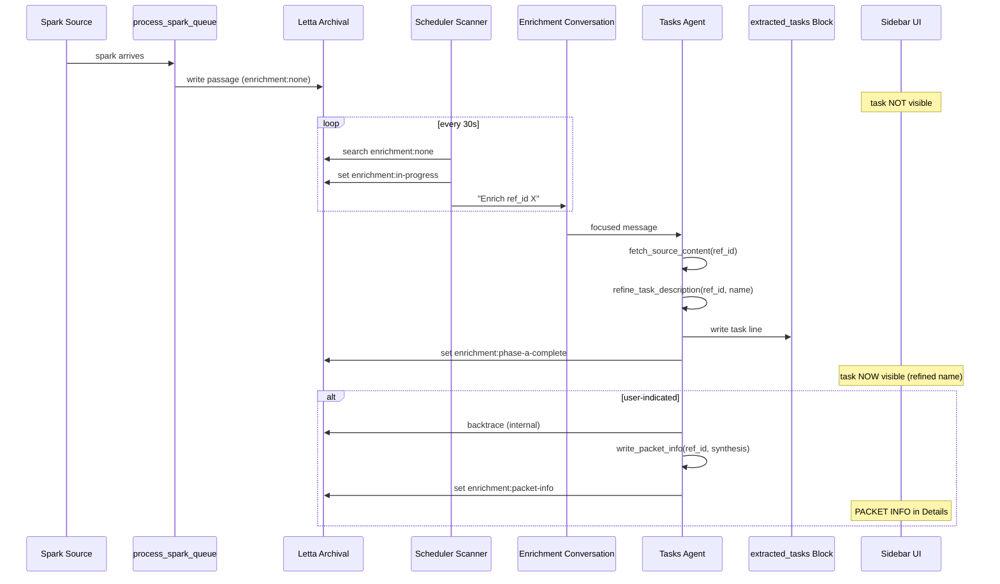

# feat: Enrichment pipeline orchestration via scheduler + dedicated conversation

## Overview

Replace persona-instruction-based Phase A/B chaining with scheduler-driven single-purpose messages to a dedicated Letta enrichment conversation. This eliminates the agent attention drift problem that causes Phases A and B to fail inconsistently, while preserving full LLM synthesis quality. Tasks become visible in the sidebar only after Phase A refinement completes.

## Problem Frame

The task extraction pipeline's Phase 0 (deterministic spark processing) works reliably. But Phases A (refinement) and B (backtracing) fail because the tasks agent's LLM reasoning drifts between tool calls in a noisy conversation context. The agent calls `backtrace_task` but doesn't follow through with `write_packet_info`, or skips Phase A entirely. Additionally, tasks appear in the sidebar immediately after Phase 0 with unrefined names. (see origin: docs/plans/2026-04-03-enrichment-pipeline-orchestration-design.md)

## Requirements Trace

- R1. Phases A and B must complete reliably without manual nudging
- R2. Tasks must not appear in the sidebar until Phase A refinement completes
- R3. Full LLM synthesis quality (as demonstrated in nudge-driven tests) must be preserved
- R4. User-indicated tasks get full backtrace; agent-identified tasks get refinement only
- R5. The pipeline must self-heal — failed enrichments retry on subsequent scanner cycles
- R6. The spark-queue-drain cron script is retired in favor of a scheduler service job

## Scope Boundaries

- Not changing the backtrace_task or write_packet_info tool internals
- Not changing the confirmation flow or OmniFocus work packet assembly
- Not building the `stage_resource` tool for MC
- Not changing MC's deeper synthesis at confirmation time
- Not implementing passive scan / agent-discovery pathways (future spark sources flow through the same pipeline unchanged)
- `phase0-complete` tasks (explicit markers with self-contained descriptions) continue to appear in the sidebar immediately — they have user-provided descriptions that are already good enough

## Context & Research

### Relevant Code and Patterns

- `letta/process_spark_queue_tool.py` lines 242-290: extracted_tasks block write to remove
- `letta/process_spark_queue_tool.py` lines 328-341: enrichment tagging logic
- `letta/refine_task_description_tool.py`: current find-and-replace pattern for task lines in block
- `letta/backtrace_task_tool.py`: function signature and return structure for internal calling
- `letta/fetch_source_content_tool.py` line 14: current signature `(source_type, fetch_hint, source_ref)`
- `scheduler-service/src/scheduler_service/services/actions.py`: `agent_message` and `lettabot_heartbeat` action patterns
- `scripts/create-analytics-pipeline-jobs.py`: job registration pattern via REST API
- `scripts/test_conversation_pilot.py` lines 106-131: Letta conversation creation pattern
- `slackbot/ai/letta_conversation.py`: conversation management with Supabase mapping

### Key Constraints Discovered

- `agent_message` action type does NOT support conversation routing. Only `lettabot_heartbeat` supports it, but that requires LettaBot infrastructure. The scanner should use a `script` action that calls the Letta conversations API directly via `POST /v1/conversations/{conversation_id}/messages`.
- Letta's `?tags=` archival query does semantic search first, then tag filter — unreliable for exact matching. Use `?search=` text substring instead.
- Letta tools cannot use nested `def` statements. Backtrace logic called internally from `refine_task_description` must be inlined or invoked via HTTP to the tool execution API.
- Without an intermediate state, the enrichment tag would stay `enrichment:none` throughout the agent's turn, allowing the scanner to dispatch the same task on consecutive cycles. The scanner prevents this by setting `enrichment:in-progress` on the passage before dispatching. The tag transitions to `phase-a-complete` when `refine_task_description` succeeds.

## Key Technical Decisions

- **Scanner as script action, not agent_message:** The `agent_message` action type doesn't support conversation routing. A Python script action can query archival and dispatch to the enrichment conversation directly via the Letta conversations API. This is self-contained and doesn't require LettaBot infrastructure for the tasks agent.

- **`enrichment:in-progress` intermediate tag:** The scanner sets this tag on the archival passage before dispatching, preventing duplicate dispatch on the next cycle. If the task is stuck at `in-progress` for >10 minutes (agent failure), the scanner resets it to `none` for retry.

- **`fetch_source_content` gains `ref_id` overload:** Rather than requiring the scanner message to include source_type and fetch_hint (adding a decision point for the agent), the tool accepts `ref_id` and looks up the passage internally. Keeps the scanner message simple.

- **`refine_task_description` uses find-or-create for block write:** Since `process_spark_queue` no longer writes to the block, the refinement tool must create the task line if it doesn't exist, not just update it. Uses the same section-header insertion pattern as `process_spark_queue`.

- **Backtrace called via HTTP within `refine_task_description`:** Rather than inlining ~300 lines of backtrace logic, `refine_task_description` calls `backtrace_task` as an HTTP request to the Letta API's tool execution endpoint or reimplements the core archival search loop using the same `urllib.request` pattern. The exact approach is deferred to implementation based on what the Letta tool execution API supports.

- **Text substring search for scanner queries:** `?search=enrichment:none` on the agent's archival endpoint reliably finds matching passages via text substring. Tag-based queries are unreliable per known Letta API limitation.

- **Atomic deployment:** Remove block write from `process_spark_queue` and add block creation to `refine_task_description` in the same deployment. Sequence: deploy `refine_task_description` first (additive/backward-compatible), then `process_spark_queue` (removal), then scanner job.

- **Weekly conversation reset:** The enrichment conversation accumulates messages at high volume (potentially hundreds/day). Weekly reset via conversation delete + recreate prevents token cost growth from context summarization.

## Open Questions

### Resolved During Planning

- **How does the scanner route messages to a specific conversation?** Via `POST /v1/conversations/{conversation_id}/messages` — the Letta conversations API supports this directly. No LettaBot infrastructure needed.
- **How does the scanner prevent duplicate dispatch?** `enrichment:in-progress` intermediate tag set before dispatch, with 10-minute timeout reset.
- **What about `phase0-complete` tasks?** They continue to appear immediately in the sidebar — their user-provided descriptions are sufficient without refinement.

### Deferred to Implementation

- **Exact mechanism for `refine_task_description` to call `backtrace_task` internally:** Either inline the archival search loop or call via Letta tool execution API. Depends on what the sandbox environment supports for HTTP calls to self.
- **Scanner batch size:** Start with 1 task per cycle. If queue depth regularly exceeds 3, increase batch size. Monitor after deployment.
- **Conversation reset automation:** Initially manual (weekly). Could become a scheduler job if operationally needed.

## High-Level Technical Design

> *This illustrates the intended approach and is directional guidance for review, not implementation specification. The implementing agent should treat it as context, not code to reproduce.*



## Implementation Units

- [ ] **Unit 1: Extend `fetch_source_content` with `ref_id` overload**

**Goal:** Allow `fetch_source_content` to accept a `ref_id` and internally look up the archival passage to extract `source_type` and `fetch_hint`, removing a decision point from the agent's enrichment turn.

**Requirements:** R1, R3

**Dependencies:** None

**Files:**
- Modify: `letta/fetch_source_content_tool.py`
- Test: `letta/tests/test_fetch_source_content.py` (create)

**Approach:**
- Add `ref_id` as an optional parameter. When provided, fetch the archival passage via `?search={ref_id}`, extract `source_type` from the `- Type:` line and `fetch_hint` from `FETCH HINT:` line. Then proceed with existing fetch logic.
- If both `ref_id` and `source_type`/`fetch_hint` are provided, `ref_id` takes precedence.
- Register updated tool with Letta via upsert.

**Patterns to follow:**
- `backtrace_task_tool.py` lines 52-76: same archival passage lookup pattern

**Test scenarios:**
- Happy path: `ref_id` provided for an email task with `fetch_hint: gmail:MSG_ID` → returns full email content
- Happy path: `ref_id` provided for a Slack task → returns thread + surrounding messages
- Edge case: `ref_id` provided but no passage found → returns error with clear message
- Edge case: `ref_id` provided but passage has no `FETCH HINT` → falls back to source_text from passage
- Happy path: existing `source_type`/`fetch_hint` params still work unchanged (backward compatibility)

**Verification:**
- Calling `fetch_source_content(ref_id="d632ac42")` returns the same content as calling with explicit `source_type="email"` and `fetch_hint="gmail:19d3fa687ef18ed1"`
- Existing callers (Phase A direct calls) continue to work without changes

---

- [ ] **Unit 2a: Extend `refine_task_description` — block write + enrichment tag**

**Goal:** Move sidebar visibility from Phase 0 to Phase A by having `refine_task_description` write the task line to the `extracted_tasks` block and update the enrichment tag. This is the critical visibility fix and ships independently of backtrace integration.

**Requirements:** R1, R2

**Dependencies:** Unit 1 (fetch_source_content ref_id overload, for the agent to call before this tool)

**Files:**
- Modify: `letta/refine_task_description_tool.py`
- Test: `letta/tests/test_refine_task_description.py` (create)

**Approach:**
- After writing the refined name to the archival passage, write the task line to the `extracted_tasks` block using find-or-create logic:
  - Search block for `ref_id: {ref_id}` in existing lines → if found, update description (current behavior)
  - If not found, create new line using archival passage metadata (extracted_time, ref_id, origin, estimate) and insert under the tasks-agent section header
  - Use the same section-header pattern as `process_spark_queue_tool.py` lines 259-286
- Update archival passage enrichment tag from `enrichment:in-progress` to `enrichment:phase-a-complete` via passage delete + re-insert (same pattern as backtrace_task_tool.py lines 417-432). Note: the current tool does NOT manage enrichment tags — this is new behavior.

**Patterns to follow:**
- `process_spark_queue_tool.py` lines 242-290: block write pattern (section discovery, line insertion, PATCH)

**Test scenarios:**
- Happy path: task line does not exist in block → creates new line with correct metadata format
- Happy path: task line already exists in block (backward compat) → updates description only
- Edge case: extracted_tasks block has no section header for tasks-agent → creates section header
- Error path: archival passage not found for ref_id → returns error, no block write
- Error path: block PATCH fails → returns error with context, archival already updated

**Verification:**
- After calling `refine_task_description` for a new task (not in block), the task appears in the sidebar API response
- Enrichment tag updated to `phase-a-complete`
- Existing callers (direct Phase A invocations) still work

---

- [ ] **Unit 2b: Add conditional backtrace to `refine_task_description`**

**Goal:** For user-indicated tasks, have `refine_task_description` internally run backtrace and return the materials so the agent can immediately call `write_packet_info` without an additional tool call.

**Requirements:** R3, R4

**Dependencies:** Unit 2a (block write and tag management must be in place)

**Files:**
- Modify: `letta/refine_task_description_tool.py`

**Approach:**
- After block write and tag update, check the passage's origin tag:
  - If `user-indicated`: call `backtrace_task(ref_id)` internally and include the structured materials in the return value
  - If `agent-identified`: skip backtrace, return refinement confirmation only
- The exact mechanism for calling backtrace internally is deferred to implementation: either inline the core archival search loop using `urllib.request` (same pattern backtrace_task uses), or call via HTTP to the Letta tool execution API if the sandbox supports it. Validate sandbox HTTP capabilities before choosing.
- Return value gains `backtrace` field (present only for user-indicated) containing the full backtrace_task output structure

**Patterns to follow:**
- `backtrace_task_tool.py`: archival search loop, anchor extraction, hit classification

**Test scenarios:**
- Happy path: user-indicated origin → backtrace materials included in return value
- Happy path: agent-identified origin → no backtrace in return, enrichment set to phase-a-complete
- Integration: calling refine_task_description for a user-indicated task produces a return value with `backtrace.direct_action`, `backtrace.artifact_candidates`, `backtrace.related_tasks`, `backtrace.mismatch_warnings` fields
- Error path: backtrace fails (archival unreachable) → refinement still succeeds, backtrace field absent, task still appears in sidebar

**Verification:**
- For user-indicated tasks, the return value includes backtrace materials the agent can use to call `write_packet_info`
- For agent-identified tasks, the return value has no backtrace field
- If backtrace integration fails, the tool does not fail — it degrades gracefully (refinement works, backtrace is missing)

---

- [ ] **Unit 3: Remove `extracted_tasks` block write from `process_spark_queue`**

**Goal:** Defer sidebar visibility to Phase A by removing the block write from Phase 0. Tasks remain invisible until enrichment completes.

**Requirements:** R2

**Dependencies:** Unit 2 (refine_task_description must be deployed and capable of creating task lines first)

**Files:**
- Modify: `letta/process_spark_queue_tool.py`

**Approach:**
- Remove lines ~242-290 (the entire block write section: block discovery, section finding, line insertion, PATCH call)
- Keep all archival passage writing unchanged (lines 292-360)
- Keep enrichment tagging unchanged — `enrichment:none` for tasks needing enrichment, `phase0-complete` for explicit markers
- For `phase0-complete` tasks (explicit markers), the block write still needs to happen somewhere. Either keep it for this category only, or accept that explicit-marker tasks also wait for the scanner. Given that explicit markers have good descriptions already, keeping the block write for `phase0-complete` only is the cleanest approach — these tasks don't need refinement.
- Register updated tool with Letta

**Patterns to follow:**
- Current code structure — surgical removal, not restructuring

**Test scenarios:**
- Happy path: spark processed with marker_type=implicit → archival passage created, NO task line in extracted_tasks block
- Happy path: spark processed with marker_type=explicit → archival passage created AND task line written to block (preserved for this category)
- Edge case: multiple sparks in one batch → each gets archival passage, only explicit ones get block entries
- Integration: after processing, sidebar API does not return the task (for non-explicit sparks)

**Verification:**
- Process a spark with no marker → task is in archival with `enrichment:none` but NOT in sidebar
- Process a spark with `[c]` explicit marker → task IS in sidebar immediately

---

- [ ] **Unit 4: Create enrichment scanner script**

**Goal:** Build the Python script that queries archival for tasks needing enrichment and dispatches focused messages to the enrichment conversation via the Letta conversations API.

**Requirements:** R1, R4, R5

**Dependencies:** Units 1-3 (tools must be ready), Unit 5 (conversation must exist)

**Files:**
- Create: `scheduler-service/scripts/enrichment-scanner.py`
- Test: `scheduler-service/scripts/tests/test_enrichment_scanner.py` (create)

**Approach:**
- The script is invoked by the scheduler service as a `script` action
- On each invocation:
  1. Query archival via `GET /v1/agents/{TASKS_AGENT}/archival-memory/?search=enrichment:none&limit=5`
  2. Filter results to passages that actually contain `enrichment:none` in their text (substring match may return false positives)
  3. Also query for `enrichment:in-progress` passages — if any are >5 minutes old (compare passage timestamp), reset their enrichment tag to `none` for retry
  4. Also query for `enrichment:phase-a-complete` + text containing `origin: user-indicated` — if >5 minutes old without `packet-info`, dispatch a reduced backtrace-only message
  5. **Pipeline busy guard:** Before dispatching, check if any passage currently has `enrichment:in-progress` AND is less than 10 minutes old. If so, skip this cycle entirely — the agent is still processing the previous task. This prevents message queue buildup in the conversation.
  6. Pick the oldest `enrichment:none` passage (by extracted timestamp)
  7. Update its enrichment tag from `none` to `in-progress` via passage delete + re-insert (same pattern as `backtrace_task_tool.py` lines 417-432)
  8. Send focused message to `POST /v1/conversations/{ENRICHMENT_CONV_ID}/messages`:
     ```
     Enrich task ref_id {X}.
     Step 1: Call fetch_source_content(ref_id="{X}") to get the full source content.
     Step 2: Read the content and formulate a clear, specific task name. Call refine_task_description(ref_id="{X}", new_description="your refined name").
     Step 3: If backtrace materials are returned, read them and call write_packet_info with your synthesis.
     If no backtrace materials are returned, you are done after Step 2.
     ```
  9. Log the dispatch (ref_id, timestamp, enrichment conversation response)
- Configuration via environment variables: `LETTA_BASE_URL`, `TASKS_AGENT_ID`, `ENRICHMENT_CONV_ID`, `ARCHIVE_ID`. These must be explicitly passed in the scheduler job's action config `env` field — the scheduler's `execute_script_action` replaces the process environment (no `os.environ` inheritance).
- The script must be in the scheduler service's allowlisted scripts directory (`scheduler-service/scripts/` → `/app/scripts` in container)

**Patterns to follow:**
- `spark-queue-drain.sh`: same "check state, nudge agent" pattern but in Python
- `scripts/create-analytics-pipeline-jobs.py`: HTTP call patterns to Letta API
- `backtrace_task_tool.py` lines 417-432: passage delete + re-insert for tag updates

**Test scenarios:**
- Happy path: one task at `enrichment:none` → tag updated to `in-progress`, message dispatched to conversation
- Happy path: no tasks needing enrichment → script exits cleanly, no API calls
- Happy path: task stuck at `in-progress` for >5 min → tag reset to `none`
- Happy path: task at `phase-a-complete` + user-indicated for >5 min → backtrace-only message dispatched
- Happy path: pipeline busy guard — recent `in-progress` task exists → scanner skips cycle entirely, no dispatch
- Edge case: multiple tasks at `enrichment:none` → only oldest dispatched (one per cycle)
- Edge case: archival search returns passages that don't actually contain `enrichment:none` (semantic false positives) → filtered out
- Error path: Letta API unreachable → script logs error, exits with non-zero, scheduler records failure
- Error path: conversation message returns 400 (agent busy) → script logs warning, tag stays `in-progress`, next cycle retries

**Verification:**
- Running the script when a task exists at `enrichment:none` results in a message appearing in the enrichment conversation
- The task's archival passage tag changes from `enrichment:none` to `enrichment:in-progress`
- Running the script again immediately does NOT dispatch the same task

---

- [ ] **Unit 5: Create enrichment conversation + register scheduler job**

**Goal:** Set up the dedicated Letta conversation for enrichment and register the scanner as a recurring scheduler job, replacing the spark-queue-drain cron.

**Requirements:** R1, R5, R6

**Dependencies:** Unit 4 (scanner script must exist)

**Files:**
- Create: `scripts/setup-enrichment-pipeline.py` (one-time setup: conversation + scheduler job)
- Modify: crontab (remove spark-queue-drain entries)

**Approach:**
- Create conversation via `POST /v1/conversations` with `agent_id={TASKS_AGENT}` and `label="enrichment-pipeline"`. Store the conversation ID.
- Register scanner job via `POST /v1/jobs`:
  - title: "Enrichment Pipeline Scanner"
  - schedule: interval, 30 seconds
  - action: script, pointing to `scripts/enrichment-scanner.py`
  - category: "enrichment_pipeline"
  - created_by: "system"
- Optionally also register a spark-queue-check job (replacing the cron) or fold spark queue checking into the scanner script
- Remove crontab entries for `spark-queue-drain.sh`
- Store `ENRICHMENT_CONV_ID` in environment (`.env` or docker-compose.yml)

**Patterns to follow:**
- `scripts/create-analytics-pipeline-jobs.py`: job registration pattern
- `scripts/test_conversation_pilot.py` lines 106-131: conversation creation

**Test scenarios:**
- Happy path: setup script creates conversation → conversation appears in Letta API with correct label
- Happy path: setup script registers job → job appears in scheduler with 30s interval
- Happy path: scheduler triggers the scanner script → execution recorded with success status
- Error path: conversation already exists with same label → script detects and reuses existing ID
- Integration: end-to-end — forward an email, verify task appears in sidebar with refined name and PACKET INFO within 2 minutes

**Verification:**
- `GET /v1/conversations?agent_id={TASKS_AGENT}` returns a conversation labeled "enrichment-pipeline"
- `GET /v1/jobs?category=enrichment_pipeline` returns the scanner job with status=scheduled
- Crontab no longer contains spark-queue-drain entries
- A test spark (Slack shortcut or email forward) flows through the full pipeline without manual nudging

---

- [ ] **Unit 6: Update tasks agent persona**

**Goal:** Remove the Phase A/B chaining instructions from the tasks agent persona. The agent no longer needs to self-chain — the scanner drives it. Add awareness of the enrichment conversation pattern.

**Requirements:** R1

**Dependencies:** Units 1-5 (pipeline must be operational)

**Files:**
- Modify: Tasks agent persona block (`block-141be962-5dfa-4b15-a38f-7625985f24e2`) via Letta API

**Approach:**
- Remove or simplify the Phase B section that currently instructs the agent to auto-chain backtrace after Phase A
- Add a note: "Enrichment messages arrive in the enrichment-pipeline conversation. Follow the steps exactly as given in each message."
- Keep the Phase A refinement protocol (Context Enrichment Protocol) since the agent still needs to reason about task names
- Keep the spark queue processing instructions since `process_spark_queue` is still called via notifications

**Test scenarios:**
- Happy path: agent receives enrichment message in dedicated conversation → follows 3-step process without drift
- Edge case: agent receives a spark notification in the regular conversation → processes spark (Phase 0 only), does not attempt Phase A/B

**Verification:**
- Agent's persona block no longer contains instructions to self-chain backtrace_task → write_packet_info
- Enrichment messages in the dedicated conversation are followed reliably

## System-Wide Impact

- **Interaction graph:** The scanner (scheduler job) → Letta conversations API → tasks agent enrichment conversation → Letta tools (fetch, refine, backtrace, write_packet_info) → Letta archival + extracted_tasks block → sidebar API. The spark notification flow (gmail-watch/slackbot → tasks agent regular conversation → process_spark_queue) is unchanged.
- **Error propagation:** Scanner failures are logged in scheduler execution history. Agent failures leave tasks at `enrichment:in-progress` with timeout recovery. Tool failures return error status in tool results. All failures are visible and recoverable.
- **State lifecycle risks:** The `enrichment:in-progress` tag creates a new state that could stick if the timeout recovery logic has bugs. Mitigation: conservative 10-minute timeout, and the state is always recoverable (reset to `none`).
- **API surface parity:** The sidebar API (`/api/tasks/{ref_id}`) already parses PACKET INFO. No changes needed. The task list endpoint reads from `extracted_tasks` block — tasks appear later now but the parsing is unchanged.
- **Integration coverage:** End-to-end test (spark → Phase 0 → scanner → enrichment → sidebar) is the critical integration scenario. Must verify with both email and Slack sources.

## Risks & Dependencies

- **Letta conversations API behavior:** We've seen conversation creation/messaging work in test scripts but haven't used it for production agent_message routing. Risk that conversation-scoped messages behave differently than default conversation messages. Mitigation: test thoroughly before retiring the cron.
- **Scanner script in scheduler allowlist:** The script must be placed in the scheduler's allowed scripts directory. If this directory isn't configured or accessible, the script action will fail. Mitigation: verify allowlist config before deployment.
- **Backward compatibility during rollout:** If `process_spark_queue` stops writing to the block before `refine_task_description` can create lines, tasks will be invisible. Mitigation: deploy Unit 2 first, then Unit 3. The find-or-create logic in Unit 2 is additive and backward-compatible.
- **Token cost of enrichment conversation:** At high throughput, the conversation's growing context adds summarization cost. Mitigation: weekly reset. Monitor token usage.

## Documentation / Operational Notes

- Update MC's `work_packet_backtracing_conventions` block to note that the tasks agent no longer self-chains — the scheduler drives enrichment
- Add `ENRICHMENT_CONV_ID` to `.env` documentation
- Add scanner job to operational runbook — how to check status, force re-run, reset stuck tasks
- Weekly conversation reset procedure: `DELETE /v1/conversations/{id}` then re-run setup script

## Sources & References

- **Origin document:** [docs/plans/2026-04-03-enrichment-pipeline-orchestration-design.md](docs/plans/2026-04-03-enrichment-pipeline-orchestration-design.md)
- Related code: `letta/process_spark_queue_tool.py`, `letta/refine_task_description_tool.py`, `letta/backtrace_task_tool.py`, `letta/fetch_source_content_tool.py`
- Scheduler patterns: `scripts/create-analytics-pipeline-jobs.py`, `scheduler-service/src/scheduler_service/services/actions.py`
- Conversation patterns: `scripts/test_conversation_pilot.py`, `slackbot/ai/letta_conversation.py`
- Letta API limitations: Project memory (archival search is semantic-first for tags, substring for search)
