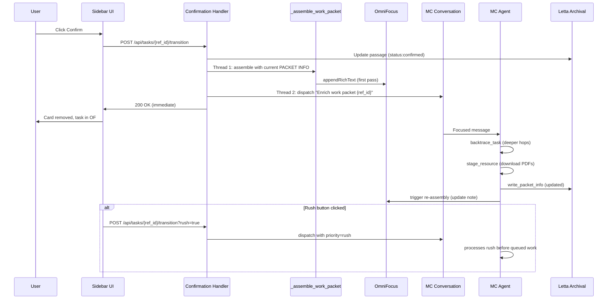

# feat: Work packet assembly via MC at task confirmation

## Overview

When a user confirms a task in the sidebar, notify MC (Mission Control agent) to perform work packet assembly: optional deeper backtrace hops, resource prioritization, and resource staging. MC updates the PACKET INFO; the existing mechanical formatter reads it and writes the OmniFocus rich-text note. Async-by-default — task confirms immediately with current PACKET INFO, OmniFocus note updates when MC finishes.

## Problem Frame

The current confirmation handler in `pa-web-ui/app.py` has two issues:

1. **Race condition:** `_assemble_work_packet` reads the archival passage immediately after confirmation, while `_trigger_backtrace` runs in parallel. If PACKET INFO wasn't already written by the enrichment pipeline, the OmniFocus note has no enrichment content.

2. **No MC involvement:** The handler targets the tasks agent for backtrace. But MC has the organizational context (important people, prior decisions, resource locations) needed for work packet judgment — what resources matter, what to prioritize, what to download/stage. MC currently isn't notified at confirmation.

The work packet should be MC-driven. MC decides *what* matters; deterministic code handles *how* (formatting, file staging).

## Requirements Trace

- R1. At confirmation, MC is notified with the task's ref_id and current PACKET INFO
- R2. MC can update PACKET INFO with deeper synthesis (additional backtrace hops, new resources, refined knowns/unknowns)
- R3. MC can call a stage_resource tool to download files (PDFs, Drive docs) to a known disk location and return openfile:// paths
- R4. Task confirms immediately; MC enrichment happens async; OmniFocus note updates in place when MC finishes
- R5. The Rush button signals MC to prioritize this task (skip queue, process immediately)
- R6. If MC is busy/offline, confirmation still works — falls back to current mechanical formatter with existing PACKET INFO
- R7. Tasks without existing PACKET INFO (edge case: user confirms before enrichment completes) still get a usable work packet

## Scope Boundaries

- Not changing the enrichment pipeline (Phase 0/A/B). The tasks agent still owns enrichment.
- Not changing MC's persona for anything outside work packet assembly.
- Not building progress indicators in the sidebar beyond a simple "MC enriching..." badge on the OmniFocus link.
- Not replacing the existing formatter (`_assemble_work_packet`) — it is invoked twice per confirmation: once immediately with current PACKET INFO, then optionally a second time by the re-assembly endpoint (Unit 5) after MC enriches PACKET INFO. Both invocations reuse the same segment-building code.
- Not changing the sidebar UI beyond the Rush button and optional status badge.
- Not building websockets or realtime updates — the OmniFocus note updates directly via appendRichText; sidebar state is not required to reflect MC completion.
- No rollback mechanism if MC writes bad PACKET INFO — we treat MC's output as authoritative.

## Context & Research

### Relevant Code and Patterns

- `pa-web-ui/app.py` (api_transition_task function, `_assemble_work_packet` at lines 2230-2361, `_trigger_backtrace` at 2363-2377) — current confirmation handler with race condition
- `pa-web-ui/app.py` (lines 1820-1850) — `parse_archival_passage` parses PACKET INFO fields
- `pa-web-ui/static/js/sidebar.js` (lines 568-800) — confirm flow; no async update pattern exists today
- `scheduler-service/scripts/enrichment-scanner.py` (lines 187-221) — conversation dispatch pattern, SSE read-fully, 307 redirect handling
- `letta/write_packet_info_tool.py` — MC writes PACKET INFO via this tool (already supports resources field)
- `letta/backtrace_task_tool.py` — MC calls for deeper hops
- `task-completion-service/completion_processor.py` (lines 140-161) — MC notification pattern with system→user role fallback
- `letta/setup_mission_control_rover.py` — MC agent setup; does NOT currently attach enrichment tools
- `omnifocus-mcp-letta/host-bridge-service.js` — generic bridge, appendRichText format documented

### Key Constraints Discovered

- **MC has no enrichment tools attached** — need to attach `backtrace_task`, `write_packet_info`, `fetch_source_content`, plus new `stage_resource`
- **MC has no dedicated conversation** — need to create "mc-work-packets" conversation for clean isolation (same pattern as tasks agent's enrichment-pipeline conversation)
- **The card disappears on confirm** — no existing async update pattern in sidebar. Simplest approach: the OmniFocus note updates directly; user sees it when they open OmniFocus. No sidebar UI state needed.
- **Existing race: assembly runs parallel to backtrace** — fix by sequencing: wait for MC (with timeout) OR skip MC if already has PACKET INFO, then assemble

## Key Technical Decisions

- **MC as work packet author, not formatter:** MC writes to PACKET INFO via `write_packet_info`. The existing `_assemble_work_packet` function reads the final PACKET INFO and produces the OmniFocus note. MC decides content; formatter handles styling.

- **Async-by-default with MC fallback:** Confirmation completes immediately. The current formatter runs with whatever PACKET INFO exists (possibly enriched by tasks agent, possibly empty). Then MC is notified separately for deeper synthesis. When MC finishes, it re-invokes the formatter to rewrite the OmniFocus note with the enriched PACKET INFO.

- **MC notification via dedicated conversation:** Create "mc-work-packets" conversation on MC agent. Confirmation handler dispatches to this conversation. Same pattern as enrichment pipeline — single-purpose focused messages, clean context, conversations API with SSE fire-and-forget.

- **stage_resource tool in Letta sandbox:** New tool MC calls to download URLs to a staging directory on the host. Returns a local path that becomes an `openfile://` link in the OmniFocus note. Tool runs via Letta sandbox's `urllib.request` (already verified to work from sandbox in previous session).

- **Rush = "skip deeper backtrace, ship fast":** Rush button sends the same MC notification with a `PRIORITY: rush` prefix in the message body. MC reads the prefix and responds by skipping deeper backtrace (uses existing PACKET INFO as-is or minimal enhancement) and skipping speculative resource staging. No separate queue — SSE fire-and-forget has no queue to jump anyway. Rush's observable effect is faster completion, not ordering. If MC is mid-processing another task, Rush waits like any other message.

- **OmniFocus note re-write, not append:** When MC finishes, the OmniFocus note is fully rewritten (cleared + appendRichText with new segments). This ensures the note reflects MC's latest synthesis without stale content from the first-pass formatter.

- **Graceful degradation:** If MC is offline/busy/errors, the confirmation still succeeds with the mechanical formatter's output. MC enhancement is purely additive.

- **Deterministic MC dispatch gate:** Before dispatching to MC, the confirmation handler checks if enrichment is "good enough already" — if PACKET INFO contains context_brief AND resources AND has enrichment:packet-info tag, skip MC dispatch unless Rush was clicked. This prevents redundant MC invocations for fully-enriched tasks, addressing the cost concern. The tasks agent's Phase B backtrace already produces good PACKET INFO in most cases; MC is the escalation path for gaps.

## Open Questions

### Resolved During Planning

- **How does MC get notified?** Via a new "mc-work-packets" conversation on MC agent, dispatched from the confirmation handler using the same SSE fire-and-forget pattern as the enrichment scanner.
- **What does Rush do?** Sends notification with `PRIORITY: rush` prefix. MC reads the prefix and skips deeper backtrace / speculative resource staging to ship the packet fast. Observable effect is faster completion, not queue-jumping (SSE fire-and-forget has no queue to jump).
- **Does the sidebar show MC's progress?** Not initially. The OmniFocus note updates directly. If needed later, a "enrichment:packet-ready" tag could drive a sidebar indicator, but v1 is fire-and-forget.

### Deferred to Implementation

- **Where does `stage_resource` save files?** Container: `/data/shared/staged/{category}/{ref_id}/`. Host: `/Users/dorseyhomeserver/Dropbox/letta-shared-files/staged/{category}/{ref_id}/`. Uses existing volume mount at `docker-compose.yml:658`, following the precedent set by `letta/notebooklm_tools.py`.
- **How does OmniFocus note clearing work?** The existing plugin is append-only. Unit 0 adds a new `setRichText` command to the plugin that clears and writes atomically. Both first-pass assembly and re-assembly use `setRichText` (not `appendRichText`) for idempotency.
- **MC notification role (system vs. user):** Follow existing pattern from `task-completion-service/completion_processor.py` — try system first, fall back to user with `[SYSTEM NOTIFICATION]` prefix.

## High-Level Technical Design

> *This illustrates the intended approach and is directional guidance for review, not implementation specification. The implementing agent should treat it as context, not code to reproduce.*

## Implementation Units

- [ ] **Unit 0: Add setRichText command to OmniFocus bridge plugin**

**Goal:** Add a `setRichText` command to the omnifocus-mcp-letta plugin that replaces a task's note atomically with new rich-text segments. Prerequisite for two-pass assembly — without this, the re-assembly pass would duplicate content since `appendRichText` is append-only.

**Requirements:** R4 (prerequisite)

**Dependencies:** None (this unit unblocks Unit 5)

**Files:**
- Modify: `omnifocus-mcp-letta/omnifocus-mcp.omnijs` (add `lib.setRichText` alongside existing `lib.appendRichText`)

**Approach:**
- Add `lib.setRichText = params => { ... }` that clears the task's note and then appends the provided segments atomically within the plugin call (no HTTP round-trip between clear and append)
- Implementation: set `t.noteText = new Text("", noteObj.style)` or equivalent to clear, then iterate segments the same way `appendRichText` does
- Same parameter schema as appendRichText: `taskId`, `segments`, `separator`
- Reuse the existing `applyStyles()` helper
- The bridge (`host-bridge-service.js`) is generic and forwards any command — no changes needed there

**Patterns to follow:**
- Existing `lib.appendRichText` in the same file (same parameter validation, segment iteration, style application)

**Test scenarios:**
- Happy path: task has existing note → setRichText replaces it with new segments
- Happy path: task has empty note → setRichText writes segments (same as append)
- Edge case: segments is empty list → note is cleared (empty result)
- Edge case: task has rich-text note with URLs/bold → clearing + new segments preserves OmniFocus state integrity
- Error path: taskId not found → returns error, task unchanged

**Verification:**
- Call `setRichText` with new segments on a task that has existing rich-text content → note contains ONLY new segments, no duplication
- Re-running `setRichText` twice produces idempotent result (not 2x content)

---

- [ ] **Unit 1: Attach enrichment tools to MC**

**Goal:** MC gains the tools it needs to do work packet synthesis: `backtrace_task`, `write_packet_info`, `fetch_source_content`. These are the same tools the tasks agent uses for enrichment, now shared with MC.

**Requirements:** R1, R2

**Dependencies:** None

**Files:**
- Create: `letta/attach_work_packet_tools_to_mc.py` (script)

**Approach:**
- Follow the pattern from `letta/attach_*.py` scripts: GET MC's current tool IDs, append the enrichment tool IDs, PATCH with the full list (never partial — known footgun from MEMORY.md)
- Tool IDs are already registered from the enrichment pipeline work
- Verify MC can call each tool successfully (basic smoke test in the script)

**Patterns to follow:**
- Existing attach scripts in `letta/attach_*.py`
- MEMORY.md note: "NEVER use PATCH /v1/agents/{id} with tool_ids to add a single tool" — always GET first, append, full PATCH

**Test scenarios:**
- Happy path: script run → MC has all 3 tools attached (verified via `/v1/agents/{MC_ID}/tools/`)
- Edge case: MC already has one of the tools → script is idempotent (no duplicate, no removal)
- Error path: bad tool ID → script errors clearly, doesn't wipe MC's existing tools

**Verification:**
- `curl /v1/agents/{MC_AGENT_ID}/tools/?limit=50 | jq '.[].name'` shows backtrace_task, write_packet_info, fetch_source_content alongside MC's existing tools

---

- [ ] **Unit 2: Create stage_resource tool**

**Goal:** MC can call `stage_resource(url_or_hint, priority, label)` to download a file to a host-accessible staging directory and get back a local path usable as openfile:// in OmniFocus notes.

**Requirements:** R3

**Dependencies:** None (Letta sandbox HTTP capability already verified)

**Files:**
- Create: `letta/stage_resource_tool.py`
- Create: `letta/register_stage_resource_tool.py` (or add to existing registration script)

**Approach:**
- Tool signature: `stage_resource(url: str, label: str, priority: str = "secondary", ref_id: Optional[str] = None) -> Dict[str, Any]`
- **Staging directory (confirmed):**
  - Container write path: `/data/shared/staged/{category}/{ref_id}/`
  - Host read path: `/Users/dorseyhomeserver/Dropbox/letta-shared-files/staged/{category}/{ref_id}/`
  - Mount exists at `docker-compose.yml:658` with `/Users/dorseyhomeserver/Dropbox/letta-shared-files:/data/shared` (read-write)
  - Precedent: `letta/notebooklm_tools.py` already uses this pair for file exchange
  - Returned `openfile_url` uses the **host path** form since `openfile-handler/main.swift` calls `NSWorkspace.shared.open(URL(fileURLWithPath: path))` directly on the host
- Categories: `pdf`, `html`, `gmail`, `drive`, `other`
- Supports initial URL types:
  - Public HTTP(S) URLs → direct download via `urllib.request` (content-type → category)
  - Google Drive/Docs URLs → fetch via gws CLI subprocess (`backtrace_task` pattern)
  - Gmail message IDs (format `gmail:MSG_ID`) → fetch via gws CLI, save as text
- Returns: `{status, local_path, openfile_url, filename, size_bytes, category}`
- Idempotency: if file exists at target path for this ref_id+label, reuse existing (check mtime — re-download if >24h old)
- File naming: `{slug(label)}.{ext}` within the per-ref_id directory
- **Dropbox sync side effect:** staged files also sync to Dropbox, which is useful for multi-device access but not required for functionality (host sees writes immediately, Dropbox sync is independent)

**Patterns to follow:**
- `backtrace_task_tool.py` for gws CLI subprocess pattern
- `fetch_source_content_tool.py` for URL handling
- CLAUDE.md Letta tool conventions (imports inside function, no nested defs, typed params only)

**Test scenarios:**
- Happy path: HTTPS URL → file downloads, path returned, file exists at expected location
- Happy path: Google Doc URL → gws CLI fetches content, saves as .html or .txt
- Happy path: Gmail message ID → email body saved as text file
- Edge case: URL already staged for this ref_id+label → returns existing path, no re-download
- Error path: 404/timeout → returns error with status, no partial file left
- Error path: unsupported URL scheme → returns error with clear message
- Error path: staging directory not writable → returns error

**Verification:**
- Tool runs from Letta sandbox (agent can invoke it successfully)
- Downloaded file exists at the returned path
- The `openfile_url` opens the file when triggered via the openfile-handler app
- Re-running for the same URL doesn't download again

---

- [ ] **Unit 3: Create mc-work-packets conversation + MC persona updates**

**Goal:** MC has a dedicated conversation for work packet assembly and persona instructions for the protocol.

**Requirements:** R1, R2, R5

**Dependencies:** Unit 1 (MC needs the tools referenced in instructions)

**Files:**
- Modify: MC persona block (via Letta API; block ID is `block-b8104f5e-caa1-452a-9a28-10c03596b0c7` per prior work)
- Create: `scripts/setup-mc-work-packet-conversation.py` (one-time setup script)

**Approach:**
- Create conversation with label "mc-work-packets" on MC agent via `POST /v1/conversations/?agent_id={MC_ID}`
- Store conversation ID as env var for confirmation handler (or look up by label at runtime — preferred per enrichment pipeline pattern)
- Add persona section "WORK PACKET ASSEMBLY" explaining:
  - When you receive a work packet message (single ref_id), you follow this protocol
  - Step 1: Read current PACKET INFO for the task (already in archival)
  - Step 2: Decide if deeper backtrace is warranted (check node coverage, related tasks, unknowns)
  - Step 3: If yes, call backtrace_task with max_hops=5 (deeper than tasks agent's default 3)
  - Step 4: Identify resources that should be staged to disk (primary URLs, critical docs)
  - Step 5: Call stage_resource for each, getting back local paths
  - Step 6: Call write_packet_info with enriched fields (resources include staged paths as openfile:// URLs, additional context from your organizational memory)
  - Step 7: Trigger OmniFocus note re-assembly (new HTTP endpoint in pa-web-ui)
- Add Rush handling: if message contains "PRIORITY: rush", process immediately, skip deeper backtrace if it would slow completion

**Patterns to follow:**
- Tasks agent persona enrichment section (already established)
- `enrichment-scanner.py` conversation lookup by label pattern
- `scripts/setup-enrichment-pipeline.py` setup script pattern

**Test scenarios:**
- Happy path: setup script creates conversation with correct label
- Happy path: MC persona contains work packet protocol section
- Edge case: conversation already exists → script finds and reuses it
- Integration: send a test message to the conversation, verify MC responds in that conversation (not its default)

**Verification:**
- `GET /v1/conversations/?agent_id={MC_ID}` returns conversation with label "mc-work-packets"
- MC persona block contains "WORK PACKET ASSEMBLY" section with 7-step protocol
- Test message dispatches reach MC and stay in this conversation

---

- [ ] **Unit 4: Confirmation handler dispatches to MC**

**Goal:** When a user confirms a task, the confirmation handler sends a focused message to the mc-work-packets conversation in addition to running the current mechanical formatter.

**Requirements:** R1, R4, R6, R7

**Dependencies:** Unit 3 (conversation must exist)

**Files:**
- Modify: `pa-web-ui/app.py` (api_transition_task function, specifically the confirmation block around `_trigger_backtrace`)

**Approach:**
- Remove the existing `_trigger_backtrace` thread (tasks agent no longer handles work packet enrichment)
- Replace with `_dispatch_mc_work_packet` thread that POSTs to mc-work-packets conversation via SSE endpoint
- Message format: single-purpose message naming the ref_id and priority flag (normal/rush)
- Keep `_assemble_work_packet` thread unchanged — it runs first with current PACKET INFO
- MC's work is additive: when MC finishes, it calls the new re-assembly endpoint (Unit 5) to rewrite the OmniFocus note
- On MC dispatch failure (conversation unreachable, 400 busy): log warning, continue. The first-pass OmniFocus note still exists.

**Patterns to follow:**
- `enrichment-scanner.py` dispatch_enrichment function (SSE fire-and-forget, trailing slash NOT allowed on conversations endpoint, read full stream)
- Existing `_assemble_work_packet` threading pattern (daemon=True, swallow exceptions)

**Test scenarios:**
- Happy path: user confirms task with PACKET INFO → OmniFocus note written with first-pass formatter, MC dispatched
- Happy path: user confirms task without PACKET INFO → OmniFocus note has minimal content, MC dispatched to enrich
- Integration: MC receives dispatch, calls tools, updates PACKET INFO, triggers re-assembly — final OmniFocus note reflects MC's synthesis
- Error path: MC conversation dispatch fails → first-pass note still written, error logged, confirmation still succeeds
- Edge case: Rush flag → message includes "PRIORITY: rush", MC prioritizes accordingly

**Verification:**
- Confirming a task produces an OmniFocus task with the first-pass note
- Within 60-120s, the OmniFocus note is updated with MC's enhanced content (visible as new resources, richer context brief, staged file links)
- If MC is offline, confirmation still completes with the first-pass note

---

- [ ] **Unit 5: Re-assembly endpoint for MC**

**Goal:** MC has an HTTP endpoint to trigger OmniFocus note re-assembly after it updates PACKET INFO. The endpoint re-reads the passage, clears the current note, and writes the enriched note.

**Requirements:** R2, R4

**Dependencies:** Unit 0 (setRichText bridge command), Unit 4 (handler refactor)

**Files:**
- Modify: `pa-web-ui/app.py` (add new route, refactor `_assemble_work_packet` to use setRichText)

**Approach:**
- New route: `POST /api/tasks/{ref_id}/reassemble-work-packet`
- Re-reads archival passage, parses PACKET INFO
- Re-runs the segment builder from `_assemble_work_packet` on the updated PACKET INFO
- Calls OmniFocus bridge `setRichText` (from Unit 0) with fresh segments — atomic clear-and-replace
- Returns success/failure status to MC (informational — MC can log it)
- **Race prevention:** Use per-ref_id threading lock in pa-web-ui. Both first-pass assembly and re-assembly acquire the lock before calling setRichText. Short-lived lock (just around the bridge call) — first-pass always completes first; if MC re-assembly fires during first-pass, it waits.
- Also refactor `_assemble_work_packet` (first-pass) to use `setRichText` instead of `appendRichText`, so the first call also clears any existing note — ensures idempotency if the handler is re-invoked.
- Authentication: validate ref_id exists and is in confirmed state before proceeding. MC's sandbox is trusted but this guard limits prompt-injection blast radius.

**Patterns to follow:**
- Existing `_assemble_work_packet` segment-building logic (extract into a shared helper function)
- Existing OmniFocus bridge call pattern

**Test scenarios:**
- Happy path: POST with valid ref_id → note is re-assembled, endpoint returns 200
- Edge case: ref_id has no PACKET INFO yet → endpoint returns 200 with message "no enrichment to assemble"
- Edge case: task has no OmniFocus ID (not confirmed) → endpoint returns 400
- Error path: OmniFocus bridge unreachable → endpoint returns 500, logs error
- Integration: MC calls endpoint after updating PACKET INFO → OmniFocus note reflects MC's updated content

**Verification:**
- Calling the endpoint updates the OmniFocus note
- Old note content is cleared/replaced (not appended)
- Endpoint is callable from MC's Letta sandbox via urllib.request to pa-web-ui

---

- [ ] **Unit 6: Rush button in sidebar**

**Goal:** Sidebar has a Rush button alongside Confirm. Clicking Rush confirms the task AND signals MC to prioritize it.

**Requirements:** R5

**Dependencies:** Unit 4 (confirmation handler must support rush flag)

**Files:**
- Modify: `pa-web-ui/static/js/sidebar.js` (confirm flow)
- Modify: `pa-web-ui/static/css/styles.css` (Rush button styling)
- Modify: `pa-web-ui/app.py` (accept `rush` parameter in transition endpoint)

**Approach:**
- Add Rush button to the confirm dialog/card actions
- Rush click → same confirmation flow as Confirm, but POSTs with `?rush=true` or `{rush: true}` in body
- Handler in app.py reads the flag, passes to MC dispatch with `PRIORITY: rush` prefix in message
- Visual distinction: Rush button has different color (e.g., orange) and icon to signal urgency
- No separate UI state during MC processing — user sees immediate confirmation

**Patterns to follow:**
- Existing confirm button wiring in sidebar.js `createOFTaskFromDialog`
- Existing CSS button styling

**Test scenarios:**
- Happy path: Rush click → task confirms, MC receives message with rush priority
- Happy path: Normal confirm click → task confirms, MC receives normal priority
- Integration: When MC has queued work and receives rush, MC processes rush first

**Verification:**
- Rush button visible and clickable in sidebar
- Clicking Rush confirms the task like Confirm does
- Handler passes rush flag through to MC message

## System-Wide Impact

- **Interaction graph:** Sidebar confirm → pa-web-ui handler → two threads: (1) first-pass assembly → OmniFocus bridge → OmniFocus note; (2) MC dispatch → mc-work-packets conversation → MC agent → Letta tools (backtrace_task, stage_resource, write_packet_info) → archival update → re-assembly endpoint → OmniFocus bridge → OmniFocus note (updated)
- **Error propagation:** MC failures are isolated and logged — they don't block confirmation. Re-assembly endpoint failures are logged but don't propagate to MC's conversation (informational). First-pass assembly failures surface to the user via the confirmation response.
- **State lifecycle risks:** The OmniFocus note is rewritten by MC, not appended. If MC crashes between "clear note" and "write new segments," the note could be empty. Mitigation: re-assembly writes atomically where possible, and the archival PACKET INFO is the source of truth — a manual re-trigger recovers.
- **API surface parity:** New endpoint `POST /api/tasks/{ref_id}/reassemble-work-packet`. Existing transition endpoint gains optional `rush` parameter (backward-compatible).
- **Integration coverage:** End-to-end confirmation → MC enrichment → updated OmniFocus note is the critical integration scenario.

## Risks & Dependencies

- **MC availability:** MC is the always-on server agent — if it's down, confirmations still work but without enrichment. Mitigation: graceful degradation already built in.
- **Staging directory growth:** Files accumulate over time. Need a cleanup policy (e.g., delete files older than 90 days for completed/rejected tasks). Deferred to post-implementation.
- **Letta sandbox file write permissions:** `stage_resource` needs to write to a host-mounted directory. If volume mount or permissions are wrong, all staging fails. Mitigation: verify permissions in Unit 2 implementation before proceeding.
- **Cost of MC invocation per confirmation:** Every MC work-packet turn replays MC's large persona (organizational context, memory blocks). Rough math: 10-20k input tokens × 5-10 tool calls × 5-10 confirms/day could reach $30-100/month. **Mitigation:** deterministic gate (see Key Technical Decisions) skips MC dispatch entirely when PACKET INFO is already populated. **Measurement requirement:** during Unit 4 integration testing, measure actual token usage for one MC work-packet turn and log it per dispatch for the first two weeks. Add a daily budget cap if cost exceeds projection. (Reference: MEMORY.md entity extraction lesson — pilot estimates for background LLM work have been 100x off.)
- **Silent failure shadow path:** If MC dispatch fails AND task had no pre-existing PACKET INFO, user gets minimal note with no retry. **Mitigation:** write `enrichment:mc-pending` tag on dispatch, clear it when re-assembly succeeds. Scanner (or a new scheduler job) re-dispatches tasks with `mc-pending` older than 15 min.

## Documentation / Operational Notes

- Update MC's `work_packet_backtracing_conventions` block to reference the new protocol
- Document the staging directory location and cleanup policy (once decided in Unit 2)
- Add the new endpoint to pa-web-ui API documentation
- Document Rush button usage in any user-facing notes

## Sources & References

- **Origin context:** `docs/plans/2026-04-03-enrichment-pipeline-orchestration-design.md` (Future Considerations section)
- Related code: `pa-web-ui/app.py` (api_transition_task, _assemble_work_packet), `letta/write_packet_info_tool.py`, `scheduler-service/scripts/enrichment-scanner.py`
- Related plan: `docs/plans/2026-04-03-001-feat-enrichment-pipeline-orchestration-plan.md` (enrichment pipeline — produces PACKET INFO that MC augments)
