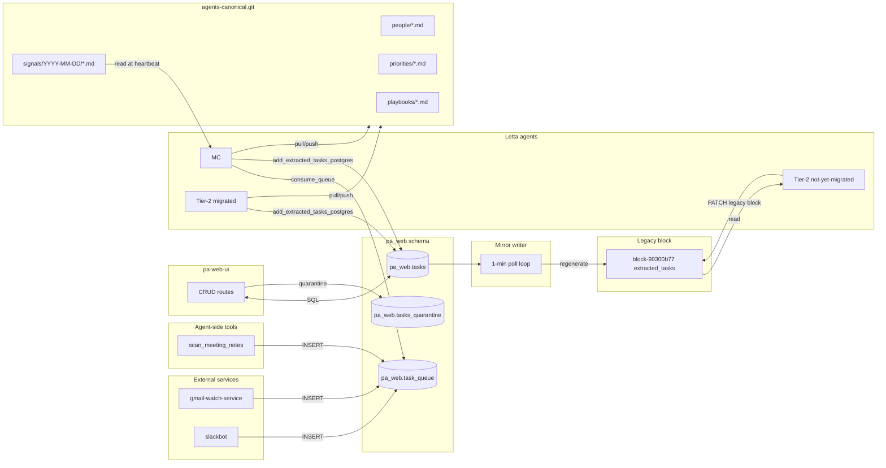
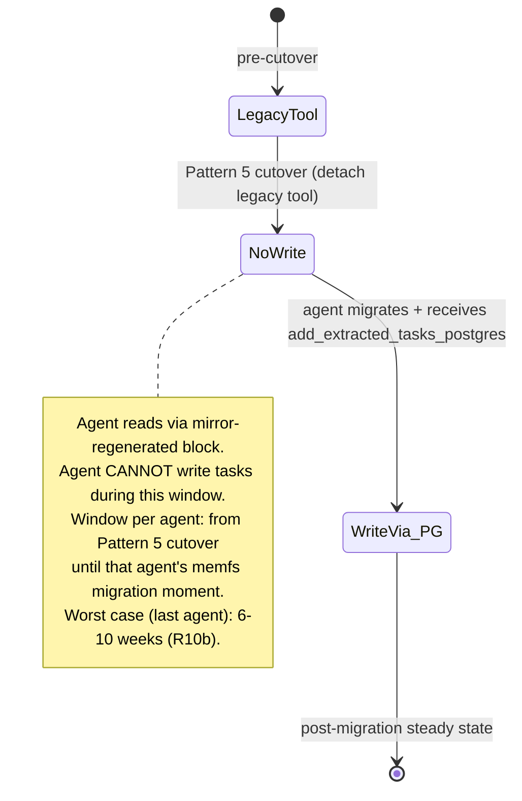

# PA Organizational Memory — Cycle 1 Substrate Buildout + MC Migration

## Overview

Cycle 1 builds the operational substrate the ai-PA ecosystem needs before any
working agent migrates from Letta v1 attached-blocks to memfs, then migrates MC
as the canary. Substrate scope: per-source Postgres queue tables (Pattern 2),
`pa_web.tasks` with archival absorption + read-shadow mirror writer + forced
no-write contract (Pattern 5), pa-web-ui CRUD swap onto Postgres, shared
canonical Gitea repo seed + per-agent skill, signal substrate (markdown files
in shared repo), MC plate-digest tool + scheduler-driven heartbeat, reflection
inbox file convention. After MC migrates and soaks 1-2 weeks, Tier-2 agents
follow one at a time. Steward, agency-rules, proposal queue, and review surface
are explicitly **cycle 2** and out of scope here.

## Problem Frame

The existing memory architecture entangles cross-agent state (queues, tasks,
canonical facts, signals) into Letta v1 shared memory blocks because that was
the only available cross-agent surface. Memfs migration forces a substrate
decomposition: each concern wants a different store. Without that decomposition
landed first, MC migrating into memfs would lose the operational layer it
depends on. Substrate-precedes-MC sequencing (path 2 in the origin doc) is
locked. (see origin: `docs/brainstorms/2026-04-26-pa-organizational-memory-architecture-requirements.md`)

## Requirements Trace

This plan satisfies the cycle-1 critical path defined in R55. Origin
requirements covered: R1 (five-layer model), R3-R6 (Pattern 2), R7-R11
(Pattern 5), R10a (mirror writer SLO + drift detection), R10b (no-write window
duration), R12 (subsumed archival), R13 (granola two-tier — `pa_web.meetings`
deferred decision per R13b), R14 (canonical references to meetings), R15
(slackbot `_write_dm_to_archival` retirement), R16-R21 (signal substrate),
R22-R29 (canonical store + LET-8217 transition shape), R30 (minimal day-1
identity rule), R32 (reflection inbox file convention), R35 (worker
self-reflection with Path C dependency), R38-R41 (MC plate-digest), R42
(plate-refresh cadence), R45-R46 (scheduler integration + cache-friendly
prompts), R47-R50 (pattern evolution sequence), R51-R54 (agent migration
scope), R55-R57 (sequencing + per-agent runbook), R58 (MC pre-migration audit),
R59 (archival passage migration policy).

Cycle-2 requirements deferred from this plan: R31, R33-R34, R36-R37, R44.

## Scope Boundaries

- Cycle 1 only. Steward agent, agency-rules skill, proposal queue substrate,
  review surface, and Layer-3 dynamic projections are cycle 2.
- Migrate **only** the in-scope working set per R51 (corrected scope below
  under Open Questions). Out of scope: companion, auto_madden,
  sports_and_media_maven, work-packet-assembler,
  main-assistant-agent-kinara (overlap resolution under Open Questions),
  pa-routing-handler coordination patterns, sleeptime mechanics individually.
- Not building Alembic for `pa_web` schema — keep the existing `CREATE TABLE
  IF NOT EXISTS` bootstrap pattern in `pa-web-ui/app.py` for continuity.
- Not building local vector index over meeting transcripts — Granola MCP
  serves that need; local index is a future fallback.
- Not promoting signals to Postgres in cycle 1 — files in shared repo;
  promote later if cadence/query-shape demands.
- Not patching Letta server further — cycle 1 inherits the existing patched
  image (`letta-local:0.16.7-memfs-v3`) and existing letta-code patches
  (Path C + memfs-git URL substitution).

## Context & Research

### Brainstorm corrections surfaced by repo research

The origin doc contains several factual statements the codebase contradicts.
This plan adopts the corrected reality and notes each correction in Open
Questions for user review.

| Origin claim | Corrected reality | Source |
|---|---|---|
| R3: "writers of `queued_tasks_from_email`" include gmail-watch | **Email queue is dead** — disabled 2026-04-09 (`watch_manager.py:730-733` comment: "Legacy queue block write disabled — spark queue is the primary pipeline.") | `gmail-watch-service/src/gmail_watch/services/task_queue_writer.py`, `watch_manager.py:730-733` |
| R3: "scheduling-orchestrator" writer | **No such service exists** in the repo | repo grep |
| R3: "queued_tasks_from_meetings writer is likely granola-ingest" | **Actual writer is the agent-side `scan_meeting_notes` Letta tool** at `letta/meeting_scan_tool.py:439`. Granola-ingest only writes archival memory. | `letta/meeting_scan_tool.py:439` |
| R3: 4 source blocks → 4 tables | Live writers target **2 distinct blocks**: `spark_queue` (block-534bb56d, written by gmail-watch + slackbot + meeting_scan_tool) and `queued_tasks_from_meetings` (block-809efd9b, written by scan_meeting_notes only). `queued_tasks_from_email` and `queued_tasks_from_slack` are both dead/migrated. | repo grep for block IDs |
| R51: 4 pulse-monitor instances | **CORRECTED 2026-04-26 mid-execution: naming is misleading.** `pulse-monitor-agent_copy` (`agent-2ed14ef4`) is the LIVE production agent (letta_v1, daily activity, monitoring/Slack/Jira/Confluence specialist). The originally-named `pulse-monitor-agent` (`agent-6eb765bf`, memgpt_v2, idle since Feb 2026) is its retired predecessor. The matching sleeptime: `pulse-monitor-agent-sleeptime` (`agent-66c4a151`, idle since Dec 2025) is also retired. `pulse-monitor-agent-sleeptime_copy` was deleted via Unit 13 (cleared pre-flight). The two retired predecessors are left in place (idle, harmless). **Phase E migration target = `agent-2ed14ef4` (letta_v1).** | `docs/research/memfs-audit-2026-04-25/agents-summary.txt` + live Letta API audit 2026-04-26 |
| R52: daily-schedule-agent's "11 cron jobs" | **3 cron jobs** all invoking `generate_daily_briefing` (verified Unit 15, falsification PASS — see `docs/runbooks/daily-schedule-falsification-audit.md`). Letta-side name is `daily-schedule-agent-sleeptime` (sleeptime_agent type, but used as cron-invoked briefing producer; the brainstorm's "daily-schedule-agent" refers to this same agent). | live scheduler at `localhost:8087/v1/jobs/` |
| R23: canonical seed from MC's blocks | MC has `important_people` ✓ but does NOT have `three_month_priorities` or `task_extraction_tool_use_guidelines`. Pull from tasks-agent / pulse-monitor instead. | live Letta API for MC |
| R7: "extracted_tasks block" (singular) | **Two active blocks share the label `extracted_tasks`**: `block-7bff4e45-...` (legacy, 15-way shared) and `block-90300b77-...` (active, hardcoded in pa-web-ui, 8-way shared). Plus `block-5a516880-...` `extracted_tasks_archived` (stale test data per project memory). Mirror writer target + 15-way reader migration must be disambiguated in pre-flight. | `docs/research/memfs-audit-2026-04-25/AUDIT.md` §"Most-shared blocks"; CLAUDE.md memory |

### Relevant Code and Patterns

**Pattern 2 (queue writers)**
- `gmail-watch-service/src/gmail_watch/services/task_queue_writer.py` —
  `TaskQueueWriter.write_to_spark_queue()` lines 225-287; `drive_task_queue_writer.py`
  subclasses it.
- `gmail-watch-service/src/gmail_watch/services/watch_manager.py:716` (email →
  spark), `:854` (drive → legacy block), `:1072` (drive → spark).
- `slackbot/listeners/shortcuts/send_to_tasks.py` — `_trigger_extraction()`
  lines 188-296 (block PATCH at 265-277, uses `requests`).
- `letta/meeting_scan_tool.py` — agent-side tool; line 439 writes to
  `queued_tasks_from_meetings`; line 549 writes to `spark_queue` for `[c]` markers.
- All three writers share the same **read-mutate-PATCH** anti-pattern (no
  optimistic concurrency); two simultaneous writers race and lose entries.
  Pattern 2 implicitly fixes this by moving to Postgres `INSERT`.

**Pattern 5 (extracted_tasks → pa_web.tasks)**
- `pa-web-ui/app.py` — surface area is fully contained:
  - 5 helpers: `parse_task_block` (3297), `parse_archival_passage` (3317),
    `_find_archival_passage` (3531), `_replace_passage` (3678),
    `_remove_ref_from_block` (3691).
  - 8 routes: `api_get_tasks` (3714), `api_get_task_detail` (3732),
    `api_update_task` (3746), `api_transition_task` (3826),
    `api_reassemble_work_packet` (4087, reads passage at 4243+),
    `api_merge_tasks` (4155), `api_omnifocus_create` (4316), `api_widget_queue`
    (4353 — separate system, not extracted_tasks).
  - 7 PATCH/GET sites against `EXTRACTED_TASKS_BLOCK_ID`: lines 3695, 3706,
    3719, 3792, 3815, 4243, 4260.
  - Constants at 3281-3282: `EXTRACTED_TASKS_BLOCK_ID = "block-90300b77-..."`,
    `TASKS_ARCHIVE_ID = "archive-f9bcaa87-..."`.
- `parse_archival_passage` already handles real-world format drift: optional
  sections, `[REJECTED]`/`[COMPLETED]`/`[MERGED]` prefix markers,
  MERGE_PARENT_ID linkage, "Knowns/Assumptions/Unknowns" alternate spellings,
  free-text "Agent notes:" blocks. **Port this parser into the migration
  script — do not rewrite.**
- `pa-web-ui/app.py:219-335` (`_bootstrap_schema()`) — `CREATE TABLE IF NOT
  EXISTS` pattern for `pa_web.*` tables. New tables follow this pattern.

**Memfs substrate (existing, reused as-is)**
- `letta-memfs-patches/local/server_scoped_delete_propagation.patch` (patch 04)
  — required to prevent shared-block wipes during multi-agent migration.
- `letta-memfs-patches/local/server_fetch_before_sync.patch` (patch 05) —
  enables Edit-via-Gitea round-trip propagation.
- `letta-memfs-patches/patches/apply_letta_code_self_hosted_handle_fix.py`
  (Path C) — required for reflection subagents (R35).
- `bin/letta-patched` wrapper + `DISABLE_AUTOUPDATER=1` — patch survival.
- `scripts/memfs-helpers/bridge-agent-to-gitea.sh` — per-agent Gitea bootstrap
  (creates repo, pushes bare → Gitea, configures `origin` for round-trips).
- `scripts/memfs-helpers/verify-agent-memfs.sh` — read-only audit (PASS/FAIL).
- `scripts/memfs-helpers/provision-helper-agents.py` — pre-creates persistent
  helper agents (general-purpose, explore, plan, init, memory, history-analyzer)
  with stable agent_ids.
- `docs/runbooks/memfs-migration-per-agent.md` — 9-phase per-agent migration
  procedure; cycle 1 reuses verbatim, augmented per-agent.

**Scheduler service (existing, reused as-is)**
- `scheduler-service/src/scheduler_service/services/actions.py:483-489` —
  supports `agent_message`, `lettabot_heartbeat`, `http`, `webhook`, `script`.
- POST `localhost:8087/v1/jobs/` with
  `schedule_type: "cron"`, `schedule_expression: {"cron": "<expr>", "timezone": "..."}`.

**pa_web schema baseline (existing)**
- Tables: `pa_web.conversations`, `pa_web.routing_signals`,
  `pa_web.thread_exchanges`, `pa_web.response_feedback`,
  `pa_web.conversation_meta`. Bootstrapped via raw SQL in
  `pa-web-ui/app.py:_bootstrap_schema()`.

### Institutional Learnings

1. **GET-append-PATCH-replace landmine.** PATCH `/v1/agents/{id}` with
   `tool_ids`, `block_ids`, or `tags` REPLACES the whole list. Per-pair detach
   endpoints exist (e.g., `/v1/agents/{id}/core-memory/blocks/detach/<id>`)
   and should be preferred. Build one shared helper for safe modify-list
   operations and reuse across all migration scripts. (CLAUDE.md memory:
   `feedback_block_ids_replace.md`; `docs/runbooks/memfs-migration-per-agent.md`
   Phase B.)
2. **Memfs-enabled agents reject `PATCH /v1/blocks/<id>` with HTTP 500.**
   Mirror writer can only target legacy (non-memfs) agents' view.
   (`docs/research/2026-04-25-c3-canary-r18-findings.md`.)
3. **Subagents require explicit `agent_id` even with Path C patch.** Path C
   enables subagents at all; explicit-`agent_id` workaround is also required
   for reliable invocation.
   (`docs/research/memfs-audit-2026-04-25/issue-4-root-cause-and-workaround.md`.)
4. **Letta sandbox `pip_requirements` format gotcha.** Use `{"name": "pkg"}`
   only — adding `version` produces invalid `pkg==>=1.0`. Sandbox config ID:
   `sandbox-b5994f17-a07d-40a4-a107-0747a14c6d44`. Configure dependencies
   BEFORE registering tools that import them. (CLAUDE.md memory: "Letta Sandbox
   Environment".)
5. **Archival lookups: `?search=ref_id` (text), not `?query=` (semantic).**
   Semantic search unreliable for exact UUID/ref_id matches. Migration script
   uses the same pattern `_find_archival_passage` already uses.
6. **MERGE_PARENT_ID linkage requires two-pass migration.** Lift all rows
   first, then resolve merge linkages on a second pass — otherwise the merge
   graph is lost.
7. **Mirror writer SLO precedent.** Drive-rag staleness sweep runs at 5-min
   cadence with retries=0, timeout=600, max_changes=1000 — these constraints
   were learned the hard way. R10a's `p95 ≤ 30s` SLO is **much tighter than
   existing internal precedent**; either accept ≥1-min cadence (consistent
   with internal infra) or commit to a Postgres LISTEN/NOTIFY pipeline.
   Decision below in Key Technical Decisions.
8. **Webhook → relay → patch 05 round-trip is fragile.** Manual `/memfs
   enable` outside the runbook skips the bridge step and breaks
   round-trips. Run `verify-agent-memfs.sh` daily during MC's soak.
9. **Round-trip propagation only works when bare repo has `origin` configured
   to Gitea.** `bridge-agent-to-gitea.sh` handles this; manual flows must
   not skip it.
10. **`_write_dm_to_archival` deprecation (R15)** is independent of Pattern 2
    queue cleanup. Two distinct cleanups; don't conflate.

### Sources & References

- **Origin document:** [docs/brainstorms/2026-04-26-pa-organizational-memory-architecture-requirements.md](../brainstorms/2026-04-26-pa-organizational-memory-architecture-requirements.md)
- Per-agent runbook: [docs/runbooks/memfs-migration-per-agent.md](../runbooks/memfs-migration-per-agent.md)
- Memfs audit: [docs/research/memfs-audit-2026-04-25/AUDIT.md](../research/memfs-audit-2026-04-25/AUDIT.md)
- Substrate research: [docs/research/memfs-audit-2026-04-25/letta-followup-brief.md](../research/memfs-audit-2026-04-25/letta-followup-brief.md)
- C3 canary findings: [docs/research/2026-04-25-c3-canary-r18-findings.md](../research/2026-04-25-c3-canary-r18-findings.md)
- Path C / subagent workaround: [docs/research/memfs-audit-2026-04-25/issue-4-root-cause-and-workaround.md](../research/memfs-audit-2026-04-25/issue-4-root-cause-and-workaround.md)
- Existing parent plan (Letta memfs upgrade): docs/plans/2026-04-24-001-feat-letta-memfs-upgrade-plan.md

## Key Technical Decisions

- **Pattern 2 target shape: single `pa_web.task_queue` table** (revised
  from R3's 4-table plan AND from earlier 2-table sketch). One table with
  `source IN ('email','slack','drive','meeting','meeting_marker')`
  replaces both `block-534bb56d` (spark_queue) and `block-809efd9b`
  (queued_meetings). Same shape across all writers; meetings already use
  `source='meeting_marker'` for marker-driven sparks (per repo research).
  One CREATE, one GRANT, one consume_queue path. R6 permits this; doing
  it now is simpler than maintaining two near-identical tables.
- **`consume_queue(source, limit)` row-claim semantics: `SELECT ... FOR UPDATE
  SKIP LOCKED` + status column transition.** Each row has a `claimed_at`
  nullable timestamp; the consumer SELECTs unclaimed rows with row lock,
  flags them claimed, returns them. Idempotent on retry — claimed rows are
  invisible to subsequent calls.
- **Pattern 5 mirror writer cadence: 1-minute polling loop, NOT
  LISTEN/NOTIFY.** Tightens the brainstorm's `p95 ≤ 30s` to a realistic
  `p95 ≤ 90s, alert at 5 min` aligned with existing internal infra
  (drive-rag sweep precedent). LISTEN/NOTIFY adds runtime complexity
  unjustified by the read-shadow window's 6-10 week lifespan. Drift
  detection: every poll cycle, regenerate the block content from
  `pa_web.tasks` and compare to current block bytes; mismatch = ALERT
  (indicates a contract violation — some agent still has the legacy write
  tool attached).
- **Pattern 5 mirror writer target block: `block-90300b77-...` only** (the
  active 8-way block referenced by pa-web-ui). The 15-way legacy block
  `block-7bff4e45-...` is **retired pre-cutover** by detaching it from any
  in-scope reader; `block-5a516880-...` (`extracted_tasks_archived`)
  remains untouched (stale test data).
- **Pattern 5 forced no-write contract mechanism: per-pair tool detach via
  `/v1/agents/{id}/tools/detach/<tool_id>` (or equivalent endpoint).** Avoids
  the `tool_ids` whole-list-replace landmine. R10's mechanism choice is
  locked to detach-the-legacy-tool (not block detach, not persona
  short-circuit) — cleanest failure mode (no mid-flight PATCH errors;
  agents simply lack the capability).
- **Forced no-write window: 6-10 week worst case (R10b).** Accepted explicitly
  as cost of avoiding dual-write drift. Planning may shorten by parallelizing
  Tier-2 migrations after MC soak validates the substrate (e.g., 2 agents
  per week post-soak instead of strictly serial).
- **Archival passage migration: port `parse_archival_passage` from
  `pa-web-ui/app.py:3317` into the migration script.** Two-pass: lift all
  rows first, then resolve MERGE_PARENT_ID linkages. Malformed passages go
  to `pa_web.tasks_quarantine` (raw_text + parse_error) per R59.
- **Sandbox pip_requirements as a cycle-1 prerequisite step.** Add
  `psycopg[binary]` (or `httpx` against PostgREST — choose at implementation)
  to sandbox config `sandbox-b5994f17-a07d-40a4-a107-0747a14c6d44` BEFORE
  registering `add_extracted_tasks_postgres`, `consume_queue`, `refresh-plate`.
  Format: `{"name": "psycopg[binary]"}` — no version field.
- **`pa_web.meetings` deferred** (R13b): no in-scope agent demands it in
  cycle 1. Granola MCP serves semantic search; the queue table
  `pa_web.task_queue (source='meeting')` serves the meeting-extraction flow. Promote to a
  full meetings table when a relational-query use-case lands.
- **Single shared canonical Gitea repo `agents-canonical.git`, not per-agent
  repos.** Plain `git clone/pull/edit/commit/push` via a per-agent skill;
  does NOT go through Letta memfs sync (which is per-agent-scoped). Auth via
  URL-embedded basic auth (same pattern as `bridge-agent-to-gitea.sh`).
  Concurrency: skill does `git pull --rebase` before push; bounded retry on
  non-fast-forward.
- **Signal substrate: markdown files at `signals/YYYY-MM-DD/<source>-<slug>.md`
  in `agents-canonical.git`.** YAML frontmatter (`description`, `source`,
  `attention_level`, `mentioned_entities`). Same skill writes signals as
  writes canonical files; the directory split is the only contract.
- **MC plate-digest cron: `*/20 7-22 * * *` America/New_York via
  `agent_message`.** Frequency anchored to "every 20 min during waking
  hours" (origin R42). Stable, skill-invoking message: `Run skill
  refresh-plate`. Cache-friendly per R46.
- **Reflection subagents: explicit `agent_id` mandatory.** Pre-create
  `helper-reflection-<agent_short_id>` per in-scope agent (or one shared
  `helper-reflection`) via `provision-helper-agents.py` extension. Path C
  patch alone is insufficient.
- **Schema migrations: continue `CREATE TABLE IF NOT EXISTS` bootstrap in
  `pa-web-ui/app.py:_bootstrap_schema()`.** No Alembic introduction in
  cycle 1 — adds carrying cost without justification. Each new table goes
  in `_bootstrap_schema()` alongside the existing five.
- **Retire stale `rover_status_log_202603a` block during MC pre-flight
  (R58).** Detach + delete (post-confirmation that no other agent depends).
- **Canary ordering reversed from origin's MC-first.** Document review
  surfaced that MC is highest-blast-radius (23 tools, 5 blocks, live
  Telegram surface) — wrong canary. **Revised order (2026-04-26
  update):**
  1. **calendar-agent_copy** (canary — no live user surface; smallest
     block/tool footprint; validates substrate end-to-end).
  2. ~~daily-schedule-agent~~ — **DEFERRED out of cycle 1** per Ezra
     guidance 2026-04-26: target agent is misclassified as
     `sleeptime_agent` (deprecating); migration path is replace-with-
     letta_v1, not `/memfs enable` in place. See
     [docs/followups/daily-schedule-agent-migration.md](../followups/daily-schedule-agent-migration.md).
     Calendar canary alone provides sufficient substrate validation.
  3. **MC** (after substrate is validated; 1-2 week soak follows).
  4. **tasks-agent** FIRST among remaining Tier-2 after MC soak —
     restoring write capability to the agent whose function is task
     management is highest priority (mitigates the 5-6 week tasks-agent
     no-write window per R-8).
  5. email-agent → docs-and-transcripts-agent →
     **pulse-monitor-agent_copy** (`agent-2ed14ef4` — the actually-live
     pulse-monitor; see Pulse-monitor disambiguation correction).
  Tier-2 order finalized per-agent in R57 plans.

## Open Questions

### Resolved During Planning (with explicit assumptions)

- **Pulse-monitor 4 instances disambiguation (R51, was Resolve-Before-
  Planning).** **REVISED 2026-04-26 mid-execution after live audit:**
  Naming was misleading. The actual live agent is
  `pulse-monitor-agent_copy` (`agent-2ed14ef4`, letta_v1 type, daily
  activity, role: "monitoring and search specialist for Slack / Jira /
  Confluence"). The original `pulse-monitor-agent` (`agent-6eb765bf`,
  memgpt_v2, idle since Feb 2026) and `pulse-monitor-agent-sleeptime`
  (`agent-66c4a151`, idle since Dec 2025) are retired predecessors,
  left in place as inert. `pulse-monitor-agent-sleeptime_copy` deleted
  via Unit 13. Phase E migration target = `agent-2ed14ef4`. Unit 10
  scope was extended mid-execution to detach `add_extracted_tasks`
  from `agent-2ed14ef4`.
- **MC vs main-assistant-agent-kinara overlap (was Resolve-Before-
  Planning).** Resolved by project memory + research: Kinara is the Slack
  app rename of Chadbot (App ID A09FS6V670B); MC is the backend Letta agent
  (`agent-90b2e860`). Slackbot's `LETTA_AGENT_ID` points to MC.
  **Assumption: no separate `main-assistant-agent-kinara` agent record
  exists; if pre-flight finds one, it's deleted (legacy artifact).** User
  course-correction welcome.
- **Pattern 2 target shape (R3-R6).** Build 2 tables (`spark_queue`,
  `queued_meetings`), not 4. Rationale: writer reality (email/slack/drive
  all consolidated to `spark_queue` block already; meetings is a separate
  block written by an agent-side tool). Symmetric per-source structure
  preserved via `source` column on `spark_queue`.
- **Mirror writer cadence.** 1-min polling, p95 ≤ 90s SLO, alert at 5 min.
  Aligns with existing internal infra precedent.
- **Mirror writer target block.** `block-90300b77` only. The 15-way legacy
  `block-7bff4e45` is detached from in-scope readers in pre-flight.
- **Forced no-write contract mechanism.** Per-pair tool-detach endpoint
  (avoids `tool_ids` whole-list landmine).
- **Sandbox pip_requirements timing.** Configured BEFORE tool registration,
  in the cycle-1 build-phase prereqs.
- **Canonical repo concurrency.** `git pull --rebase` + bounded retry in
  the agent-side skill. No per-agent branches initially.

### Deferred to Implementation

- **Exact `pa_web.tasks` column list.** Schema sketched in Unit 5; final
  column choice depends on the parser-port phase reading representative
  archival passages. (Origin R7 deferred-to-planning item; resolves during
  Unit 5.)
- **Exact `consume_queue` Postgres client choice** (`psycopg[binary]` vs.
  `httpx` against PostgREST). Decided in Unit 3 against tool-size +
  sandbox-import-time constraints.
- **MC's plate-digest token budget.** Origin says ~200-300 tokens; final
  size depends on what fits and what MC needs. Tunable post-MC-migration.
- **Tier-2 migration order beyond MC.** Per-agent runbook augmentations
  (R57) finalized before each Tier-2 agent migrates.
- **Granola-ingest pre-flight verification** (R3) — verify before Pattern 2
  cutover that nothing else still PATCHes the dead `queued_tasks_from_email`
  / `queued_tasks_from_slack` blocks.
- **Daily-schedule-agent's actual cron job count.** Origin says 11; live
  scheduler shows 3. Verify in Unit 13 falsification audit (R52).
- **Whether `pa_web.task_queue (source='meeting')` or `pa_web.meetings` is the right
  promotion target** when a relational use-case lands. (R13b deferred
  decision; resolves only when justified.)

## High-Level Technical Design

> *This illustrates the intended approach and is directional guidance for
> review, not implementation specification. The implementing agent should
> treat it as context, not code to reproduce.*

### Cycle-1 substrate flow (post-buildout, pre-MC-migration)

### Pattern 5 forced no-write contract state machine

## Implementation Units

Phased delivery (substrate buildout → MC migration → soak):

### Phase A — Foundations and prerequisites

- [ ] **Unit 1: Sandbox pip_requirements + canonical-store auth env**

**Goal:** Configure Letta sandbox with the Postgres client all new tools
need; provision `GITEA_CANONICAL_TOKEN` for the canonical-repo skill.

**Requirements:** R4, R8, R39 (tool import-time prerequisites); R22, R27
(canonical repo auth).

**Dependencies:** None.

**Files:**
- Modify: `.env` (add `GITEA_CANONICAL_TOKEN=<scoped-token>`).
- Modify: Letta sandbox config (via PATCH
  `http://localhost:8283/v1/sandbox-config/sandbox-b5994f17-a07d-40a4-a107-0747a14c6d44`)
  — add `{"name": "psycopg[binary]"}` to `pip_requirements`.
- Test: `scripts/memfs-helpers/verify-sandbox-deps.sh` (new) — confirms
  Postgres client importable inside sandbox.

**Approach:**
- Use the documented `{"name": "pkg"}` format (no version field).
- Verify sandbox import works before any tool registration.
- Provision a dedicated Gitea token for `agents-canonical.git` distinct
  from `GITEA_MEMFS_TOKEN` (clean blast-radius separation).

**Patterns to follow:**
- CLAUDE.md memory entry "Letta Sandbox Environment".
- `scripts/memfs-helpers/bridge-agent-to-gitea.sh` for the auth env shape.

**Test scenarios:**
- Happy path: sandbox config PATCH returns 200; subsequent tool registration
  with `import psycopg` does not fail at import time.
- Error path: invalid `pip_requirements` format (with version) is REJECTED
  before save (validate locally).

**Verification:** Sandbox config has the new pip requirement; a test tool
that does `import psycopg; print(psycopg.__version__)` runs successfully when
called via Letta.

- [ ] **Unit 2: GET-append-PATCH safe-list helper**

**Goal:** Centralize the pattern for safely modifying agent `tool_ids`,
`block_ids`, and `tags` without the whole-list-replace landmine. Reused by
every migration script in this plan.

**Requirements:** Cross-cutting (R10 tool detach, R57 per-agent migrations,
R58 MC pre-flight).

**Dependencies:** None.

**Files:**
- Create: `scripts/memfs-helpers/agent_list_ops.py`.
- Test: `scripts/memfs-helpers/test_agent_list_ops.py`.

**Approach:**
- Functions: `safe_attach_tool(agent_id, tool_id)`,
  `safe_detach_tool(agent_id, tool_id)`,
  `safe_attach_block(agent_id, block_id)`,
  `safe_detach_block(agent_id, block_id)`,
  `safe_set_tags(agent_id, add=[], remove=[])`.
- Each function: GET current full list → mutate locally → PATCH full list
  back. (For tools/blocks where per-pair detach endpoints exist, prefer
  those — see Patterns to follow.)
- Each function checks the current list contains/lacks the target ID
  appropriately (idempotent re-runs).
- Wrap with retries on transient HTTP errors; abort on 4xx.

**Patterns to follow:**
- `docs/runbooks/memfs-migration-per-agent.md` Phase B (block detach via
  `/v1/agents/{id}/core-memory/blocks/detach/<id>` — preferred over
  whole-list PATCH).
- CLAUDE.md memory `feedback_block_ids_replace.md` for the landmine
  description.

**Test scenarios:**
- Happy path: attach tool to agent that doesn't have it → tool count +1, all
  prior tools intact; idempotent re-run = no change.
- Edge: detach tool that doesn't exist on agent → no-op, no error.
- Error path: GET fails (404 agent) → AbortError raised before any PATCH.
- Integration: parallel detach calls on same agent serialize correctly (no
  list-version interleaving).

**Verification:** Helper used by Unit 7 (mirror writer setup) and Unit 13
(MC migration) without any agent's tool/block list being clobbered.

- [ ] **Unit 3: Postgres-writer custom tools (`consume_queue`,
  `add_extracted_tasks_postgres`, `refresh_plate`)**

**Goal:** Three new agent-side custom Letta tools that talk to Postgres
directly. Registered but NOT yet attached to any agent (attachment is
per-migration in Phase D).

**Requirements:** R4, R8, R39.

**Dependencies:** Unit 1 (sandbox has psycopg).

**Files:**
- Create: `letta/tools/consume_queue.py`.
- Create: `letta/tools/add_extracted_tasks_postgres.py`.
- Create: `letta/tools/refresh_plate.py`.
- Modify: `letta/register_pa_web_tools.py` (new aggregate registration script).
- Test: `letta/tools/test_postgres_tools.py` (calls each tool's body
  directly with a test Postgres URL).

**Approach:**
- Each tool body follows the strict Letta-tool requirements per
  `context/coding_custom_letta_tools.md`: imports inside function, no nested
  defs, basic JSON types only, full `Args:` docstring, try/except wrap,
  `Dict[str, Any]` return.
- `consume_queue(source: str, limit: int = 10) -> Dict[str, Any]`:
  **single-statement atomic claim** to survive Letta sandbox subprocess
  lifecycle —
  `UPDATE pa_web.task_queue SET claimed_at = NOW() WHERE id IN
  (SELECT id FROM pa_web.task_queue WHERE claimed_at IS NULL AND
  source = %s ORDER BY created_at LIMIT %s FOR UPDATE SKIP LOCKED)
  RETURNING *`. Returns rows + count. (Two-statement SELECT-then-UPDATE
  would lose the row lock when the sandbox subprocess returns.)
- `add_extracted_tasks_postgres(ref_id, source, source_ref, raw_text, ...)
  -> Dict[str, Any]`: INSERT into `pa_web.tasks` with the column set
  finalized in Unit 5. Returns inserted row.
- `refresh_plate() -> Dict[str, Any]`: queries `pa_web.tasks` for active
  set + reads top-N signals from canonical-skill-cached path + reads top
  `priorities/*.md`; renders ~200-300 token digest; writes via the
  canonical-skill helper to MC's `reference/current-plate.md` (or returns
  text for MC to Edit).
- Postgres URL from env (`POSTGRES_URL` or `SCHEDULER_DB_URL` reuse).

**Patterns to follow:**
- `letta/extracted_tasks_block_tool.py` (the existing v1 add tool) for the
  Letta-tool body shape.
- `context/coding_custom_letta_tools.md` rules.

**Test scenarios:**
- Happy path: `consume_queue("email", 5)` returns 5 rows from a seeded
  spark_queue; subsequent call returns 0 (rows are claimed).
- Edge: `consume_queue("email", 0)` returns empty list cleanly.
- Error path: bad source name → returns `{"status": "error", ...}` not raise.
- Edge: `add_extracted_tasks_postgres` with duplicate ref_id → ON
  CONFLICT-aware behavior (decided in Unit 5 schema).
- Integration: `refresh_plate` end-to-end against a seeded test schema
  produces a digest that fits the token budget.

**Verification:** All three tools registered in Letta tool registry; can be
invoked via `/v1/tools/{id}/run` with test args without import-time errors.

### Phase B — Pattern 2 (per-source queue migration)

- [ ] **Unit 4: `pa_web.task_queue` schema**

**Goal:** Create the single queue table in `pa_web` schema via the existing
`_bootstrap_schema()` pattern. (Revised from earlier two-table design;
single table is simpler and matches actual writer shape.)

**Requirements:** R3-R6.

**Dependencies:** Unit 1 (sandbox), Unit 2 (helper).

**Files:**
- Modify: `pa-web-ui/app.py` (extend `_bootstrap_schema()`, lines ~219-335).
- Test: `pa-web-ui/test_schema_bootstrap.py` (new) — round-trips a
  CREATE-then-INSERT-then-SELECT for each new table.

**Approach:**
- `pa_web.task_queue`: columns `id BIGSERIAL PRIMARY KEY`, `source TEXT
  NOT NULL CHECK (source IN
  ('email','slack','drive','meeting','meeting_marker'))`, `source_ref
  TEXT NOT NULL`, `payload JSONB NOT NULL` (freeform per-source extras),
  `created_at TIMESTAMPTZ DEFAULT NOW()`, `claimed_at TIMESTAMPTZ NULL`,
  `processed_at TIMESTAMPTZ NULL`. Indexes on `(source, claimed_at)` for
  `consume_queue` queries. **`UNIQUE (source, source_ref)` constraint**
  enables Unit 6's `INSERT ... ON CONFLICT (source, source_ref) DO
  NOTHING` idempotency.
- Created via `CREATE TABLE IF NOT EXISTS`; idempotent on re-run.
- PostgREST `GRANT` on the new table (per CLAUDE.md memory: "After
  restoring a schema, grant permissions").

**Patterns to follow:**
- Existing `_bootstrap_schema()` in `pa-web-ui/app.py:219-335` for the
  CREATE pattern + GRANT pattern.

**Test scenarios:**
- Happy path: app startup creates the table; INSERT + SELECT round-trips.
- Edge: re-run on existing schema is no-op (CREATE IF NOT EXISTS).
- Error path: `source = 'foo'` violates check constraint.
- Integration: `consume_queue("email", N)` reads rows inserted via raw SQL.
- Integration: `consume_queue("meeting", N)` reads rows from same table.

**Verification:** Table visible in `psql \dt pa_web.*`; PostgREST returns
data via `GET /pa_web/task_queue?limit=1`.

- [ ] **Unit 5: `pa_web.tasks` + `pa_web.tasks_quarantine` schema**

**Goal:** Create the canonical tasks table absorbing both block-line and
archival-passage layers (R7); create quarantine table for malformed
passages (R59).

**Requirements:** R7, R59.

**Dependencies:** Unit 4 (extends `_bootstrap_schema()` further).

**Files:**
- Modify: `pa-web-ui/app.py` `_bootstrap_schema()` to create two new
  tables: `pa_web.tasks` (canonical task store, both layers absorbed)
  and `pa_web.tasks_quarantine` (malformed passages).
- Test: `pa-web-ui/test_schema_bootstrap.py`.

**Approach:**
- Read 50 representative archival passages via `/v1/agents/{tasks-agent}/archival-memory?limit=50`
  to ground the column choice in actual data.
- `pa_web.tasks` columns (sketch — finalize against the 50-passage sample):
  - Block-line layer: `ref_id TEXT PRIMARY KEY`, `extracted_at TIMESTAMPTZ`,
    `source TEXT`, `source_ref TEXT`, `origin TEXT`, `est_minutes INT`,
    `raw_description TEXT`, `extracted_by TEXT`, `status TEXT`,
    `merged_into TEXT NULL`, `omnifocus_id TEXT NULL`, `due_date DATE NULL`,
    `priority INT NULL`, `owner TEXT NULL`.
  - Archival-passage layer: `task_body TEXT`, `source_metadata JSONB`,
    `related_urls TEXT[]`, `omnifocus_pending_at TIMESTAMPTZ NULL`,
    `omnifocus_created_at TIMESTAMPTZ NULL`, `enrichment JSONB NULL`,
    `agent_notes TEXT NULL`, `merge_parent_id TEXT NULL`,
    `tags TEXT[] DEFAULT '{}'`.
  - Lifecycle: `created_at TIMESTAMPTZ`, `updated_at TIMESTAMPTZ`,
    `closed_at TIMESTAMPTZ NULL`.
- `pa_web.tasks_quarantine`: `passage_id TEXT PRIMARY KEY`,
  `raw_text TEXT NOT NULL`, `parse_error TEXT NOT NULL`,
  `quarantined_at TIMESTAMPTZ DEFAULT NOW()`.
- Add `migration_source TEXT NOT NULL DEFAULT 'live'` to `pa_web.tasks`
  with two values: `'archival_lift'` (set by Unit 12 on initial lift)
  vs `'live'` (set by Unit 9 pa-web-ui CRUD UPDATEs and any agent tool
  writes). Two values are sufficient for Unit 12's conflict-aware
  predicate; cycle 1 doesn't need finer differentiation.
- **Orphan merges (parent quarantined or missing)**: tracked via
  `enrichment.merge_orphan_parent = <parent_passage_id>` JSON field on
  the child row. No dedicated table — orphan count surfaces via SQL
  query when needed. Defer dedicated table to cycle 2 if volume justifies.
- Indexes: `tasks(status, updated_at)`, `tasks(merged_into) WHERE
  merged_into IS NOT NULL`, `tasks(owner) WHERE owner IS NOT NULL`.

**Patterns to follow:**
- Existing `_bootstrap_schema()` shape.
- `parse_archival_passage` field set at `pa-web-ui/app.py:3317` defines the
  archival-layer columns to capture.

**Test scenarios:**
- Happy path: INSERT row covering both layers + SELECT returns equal value.
- Edge: NULL columns in optional layer (passage with no OMNIFOCUS section).
- Edge: `tags TEXT[]` round-trips array values.
- Integration: pa-web-ui `api_get_tasks` reads via SELECT post-migration
  (Unit 9).

**Verification:** Tables exist; INSERT/SELECT for both layers works.

- [ ] **Unit 6: External-service writer cutover to Postgres**

**Goal:** Replace block-PATCH writes in gmail-watch-service and slackbot
with Postgres INSERTs into `pa_web.task_queue`. Leave the agent-side
`scan_meeting_notes` Letta tool for a separate edit (Unit 6b).

**Requirements:** R3, R5.

**Dependencies:** Unit 4 (tables exist).

**Files:**
- Modify: `gmail-watch-service/pyproject.toml` — add `psycopg[binary]`
  dependency (gmail-watch has no Postgres client today).
- Modify: `gmail-watch-service/Dockerfile` — ensure binary deps for
  psycopg present.
- Modify: `docker-compose.yml` — add `POSTGRES_URL` env to gmail-watch-
  service and slackbot service blocks.
- Modify: `slackbot/pyproject.toml` — add `psycopg[binary]`.
- Modify: `slackbot/Dockerfile` — binary deps.
- Modify: `gmail-watch-service/src/gmail_watch/services/task_queue_writer.py`
  — replace `write_to_spark_queue()` (lines 225-287) Letta-PATCH with
  Postgres INSERT.
- Modify: `gmail-watch-service/src/gmail_watch/services/drive_task_queue_writer.py`
  — same shape.
- Modify: `gmail-watch-service/src/gmail_watch/services/watch_manager.py`
  — line 854 (`if settings.drive_task_queue_block_id:`) becomes
  no-op / removed; spark write path at line 716 + 1072 unchanged caller-side
  (writer rewrite handles it).
- Modify: `slackbot/listeners/shortcuts/send_to_tasks.py` — replace
  `_trigger_extraction()`'s Letta-PATCH at lines 265-277 with Postgres INSERT.
- Test: `gmail-watch-service/tests/test_postgres_writer.py` (new) — INSERT
  round-trip against test DB.
- Test: `slackbot/tests/test_send_to_tasks_postgres.py` (new).

**Approach:**
- New writer reads Postgres URL from existing env (gmail-watch already has
  Postgres access for other purposes — verify; otherwise add `POSTGRES_URL`).
- Removes Letta API token requirement from these services (R5).
- Idempotency: writer constructs deterministic `source_ref` per source;
  `INSERT ... ON CONFLICT (source, source_ref) DO NOTHING` if applicable.
- Legacy `_write_dm_to_archival` in slackbot is removed in this same edit
  (R15).

**Execution note:** Add a smoke test on a staging gmail-watch instance
before disabling the block-write path on production gmail-watch.

**Patterns to follow:**
- Existing block-PATCH code in `task_queue_writer.py` for the JSON shape
  (becomes the JSONB payload).
- `pa-web-ui/app.py` Postgres connection pattern.

**Test scenarios:**
- Happy path: gmail-watch writes a task → row appears in `spark_queue` with
  `source='email'` (or `'drive'`).
- Happy path: slackbot Send-to-Tasks shortcut → row appears with
  `source='slack'`.
- Edge: duplicate `source_ref` on retry → idempotent (no double row).
- Error path: Postgres unreachable → writer logs + retries with backoff;
  does NOT silently drop tasks.
- Integration: `consume_queue("email", 5)` reads rows the writer just
  produced.

**Verification:** `queued_tasks_from_drive` block (block-cfbba10b) and
spark_queue block stop receiving writes from gmail-watch and slackbot;
`pa_web.task_queue` row count grows on each event.

- [ ] **Unit 6b: Agent-side `scan_meeting_notes` rewrite to write
`pa_web.task_queue (source='meeting')`**

**Goal:** Rewrite the agent-side meetings writer to INSERT into Postgres
instead of PATCHing `block-809efd9b`.

**Requirements:** R3.

**Dependencies:** Unit 1 (sandbox), Unit 4 (table exists).

**Files:**
- Modify: `letta/meeting_scan_tool.py` lines 439 (block PATCH) and 549
  (spark PATCH) — replace with Postgres INSERTs into `pa_web.task_queue (source='meeting')`
  (line 439) and `pa_web.task_queue` (line 549, source='meeting_marker').
- Test: `letta/test_meeting_scan_tool.py` (new) — exercises the tool body
  against a test schema.

**Approach:**
- Tool body must conform to Letta custom-tool rules (imports inside, no
  nested defs).
- Returns `Dict[str, Any]` with `status` + `inserted_count`.
- Tool stays attached to docs-and-transcripts-agent (its current writer);
  re-registered post-edit via existing pattern.

**Patterns to follow:**
- Unit 3 tool bodies for the Postgres-write shape.
- `context/coding_custom_letta_tools.md` rules.

**Test scenarios:**
- Happy path: tool processes a meeting file → row in queued_meetings with
  meeting_id as `source_ref`.
- Happy path: `[c]` markers in meeting → rows in `spark_queue` with
  `source='meeting_marker'`.
- Edge: re-scan same meeting → idempotent (deterministic source_ref).
- Error path: malformed meeting markdown → returns error status, not raise.

**Verification:** docs-and-transcripts-agent invokes `scan_meeting_notes`
post-edit and writes to Postgres only.

### Phase C — Pattern 5 (extracted_tasks read-shadow)

- [ ] **Unit 7: Block disambiguation pre-flight**

**Goal:** Before mirror writer is built, identify exactly which
`extracted_tasks`-labeled blocks exist, who reads them, and which are in
scope. Detach in-scope readers from the legacy 15-way block, leave the
8-way active block as the mirror target.

**Requirements:** R7, R10 (mirror writer scoping).

**Dependencies:** Unit 2 (helper).

**Files:**
- Create: `scripts/memfs-helpers/extracted-tasks-disambiguation.py` — reads
  Letta API, enumerates all blocks labeled `extracted_tasks`*, lists
  attached agents per block, prints disambiguation report.
- Modify: `docs/research/memfs-audit-2026-04-25/AUDIT.md` — append the
  disambiguation outcome.

**Approach:**
- Script outputs: for each extracted_tasks-labeled block, (block_id,
  agent_count, in_scope_agents, out_of_scope_agents).
- Manual decision step (output flagged for human review): for each in-scope
  agent attached to the legacy 15-way block but not the active 8-way:
  - Option 1: re-attach to the 8-way block before Pattern 5 cutover (read
    consistency);
  - Option 2: drop the in-scope agent's read of extracted_tasks entirely
    (only valid if the agent doesn't actually use it).
- Output is checked into `docs/research/memfs-audit-2026-04-25/`.

**Patterns to follow:**
- `scripts/memfs-helpers/verify-agent-memfs.sh` for the read-only
  audit-script shape.

**Test scenarios:**
- Integration: script runs against live Letta and produces a report
  matching the audit's "Most-shared blocks" §.

**Verification (pre-flight only — final mirror-target verification gates
on Unit 8 deployment):** Disambiguation report exists; mirror writer's
target block_id is unambiguous (`block-90300b77-...`); 15-way legacy
block has no in-scope readers (or in-scope readers are explicitly slated
for re-attachment to the 8-way block).

- [ ] **Unit 8: Mirror writer process**

**Goal:** Background process that polls `pa_web.tasks` every minute,
regenerates the legacy `extracted_tasks` block content, PATCHes the active
8-way block (`block-90300b77`), detects drift.

**Requirements:** R10, R10a, R10b, R11.

**Dependencies:** Unit 5 (`pa_web.tasks` exists), Unit 7 (target block
disambiguated), Unit 12 (data lift complete).

**Files:**
- Create: `mirror-writer/Dockerfile`.
- Create: `mirror-writer/main.py` — polling loop.
- Create: `mirror-writer/render.py` — converts `pa_web.tasks` rows to
  block-line text matching `TASK_LINE_PATTERN` (`pa-web-ui/app.py:3290`).
- Create: `mirror-writer/drift.py` — compares regenerated content to
  current block content; emits structured warning on mismatch.
- Modify: `docker-compose.yml` — add `mirror-writer` service on
  `pa-internal` network.
- Test: `mirror-writer/tests/test_render.py`, `test_drift.py`.

**Approach:**
- **30-second polling loop** (single path, matches pa-web-ui sidebar's
  30s polling cadence; aligns with KTD's "polling, NOT LISTEN/NOTIFY"
  decision — the deepening pass over-added LISTEN/NOTIFY; rolled back).
- Each iteration:
  1. SELECT `pa_web.tasks` rows where `closed_at IS NULL` (active set);
     paginate if size grows beyond ~500.
  2. Render to block-line text via the same format `parse_task_block`
     already parses.
  3. GET current block value; **parse current and rendered into
     `Set[(ref_id, content_hash)]`**.
  4. **Update signal (drives PATCH):** PATCH block only when the parsed
     set differs (not byte equality). Eliminates spurious PATCHes from
     Letta whitespace/ordering normalization.
  5. **Drift signal (drives ALERT):** if the parsed current block contains
     a `ref_id` not in `pa_web.tasks` (active or closed set), OR a
     `ref_id` whose content hash differs from PG-rendered for the same
     row → ALERT. This is the contract-violation signal (some agent
     retained the legacy `add_extracted_tasks` tool).
- **Failure handling (revised):**
  - Transient 5xx on PATCH or GET → exponential backoff (1s, 2s, 4s, …
    capped at 60s); resume normally on success.
  - **Halt + page only** when one of: (a) 5 consecutive same-class
    failures within 10 min (e.g., 5×500 from the same Letta endpoint);
    OR (b) 4xx response body matches
    `/memfs|filesystem.memory|incompatible.block.type/i` (genuine
    memfs-attached signal); OR (c) `mirror_writer_halted_manual=true`
    operator gate. *Pause* (auto-resumes when health recovers) is
    distinct from *halt* (requires human acknowledge).
- SLO: **p95 lag ≤ 120s, alert at 5 min lag.** (Loosened from origin
  R10a's 30s after empirical analysis: 30s polling + GET+PATCH+render
  base latency + retry backoff exhaust the 90s budget under transient
  load.)
- Health endpoint `/health` returns `{"last_sync_at": ...,
  "last_lag_seconds": ..., "halted": bool, "halt_reason": str|null,
  "quarantine_size": int}`.
- On restart: idempotent — first iteration regenerates from PG
  state-of-the-world.

**Critical pre-deployment empirical tests:**
1. **Round-trip parsed-set equality:** load current `block-90300b77`
   content, parse, render, assert parsed-set equality. If equality
   fails, document the normalization delta and ensure the comparator's
   logic absorbs it.
2. **Halt-condition response capture:** intentionally PATCH a known
   memfs-attached block; capture exact response status code + body
   text; write the halt-condition matcher against that real data.
   Institutional Learning #2 says memfs returns 500 (not 4xx); the
   sketched regex is invented and structurally wrong as written.
   Replace with the empirically-captured matcher.

If either empirical test cannot be made to pass: per strategic decision
C2, **pause cycle 1** and resolve before proceeding (Unit 10 cutover
must not run without a working drift-detection path). No fallback Plan B
is documented; resolution is required.

**Execution note:** Implement drift detection test-first — the alert is the
substrate's truth-keeper.

**Patterns to follow:**
- Drive-rag staleness sweep cadence + retry constraints
  (`docs/plans/2026-02-17-drive-staleness-sweep-design.md`).
- `pa-web-ui/app.py:3290-3294` `TASK_LINE_PATTERN` for the rendered shape.

**Test scenarios:**
- Happy path: insert row in pa_web.tasks → within 30s, block PATCH
  happens; rendered content parses cleanly through `parse_task_block`.
- Happy path: parsed-set equality between current and rendered → NO PATCH
  emitted (avoids spurious writes from Letta normalization).
- Edge: empty tasks set → block content becomes empty (or sentinel
  header).
- Drift detection (set-based): manually PATCH legacy block to add a
  ref_id NOT in pa_web.tasks → next poll alerts; mirror still writes its
  truth.
- Drift detection (content hash): manually PATCH a single ref_id's line
  with mutated description → alert fires; mirror overwrites.
- Round-trip empirical: production block content survives parse-render-
  parse with set equality.
- Error path: transient 500 on PATCH → exponential backoff, retry; lag
  grows; resumes on next success (no halt).
- Error path: 5×500 within 10 min from same endpoint → HALT + page.
- Error path: 4xx body matching memfs-incompatibility regex → HALT + page.
- Error path: Postgres unreachable → loop logs, lag metric grows; alert
  at 5 min.
- Integration: not-yet-migrated agent reads block content reflecting
  recent pa_web.tasks INSERTs (polling p95 ≤ 120s).

**Verification:** Mirror writer healthy; lag p95 ≤ 120s under load; halt
events per week tracked as acceptance metric (target: 0 outside known
incidents); drift detection fires when block tampered with; round-trip
empirical test passes before drift detection is trusted.

- [ ] **Unit 9: pa-web-ui CRUD swap**

**Goal:** Port the 8 task-management routes + retire the 5 helpers in
`pa-web-ui/app.py` to read/write `pa_web.tasks` directly. Block + archival
PATCHes removed.

**Requirements:** R9.

**Dependencies:** Unit 5 (`pa_web.tasks` exists), Unit 12 (data lifted).

**Files:**
- Modify: `pa-web-ui/app.py`:
  - Remove helpers (lines 3297, 3317, 3531, 3678, 3691).
  - Rewrite routes (lines 3714, 3732, 3746, 3826, 4087, 4155, 4316).
  - Remove all 7 PATCH/GET sites against `EXTRACTED_TASKS_BLOCK_ID` (3695,
    3706, 3719, 3792, 3815, 4243, 4260).
  - Constants `EXTRACTED_TASKS_BLOCK_ID` and `TASKS_ARCHIVE_ID` may stay
    until mirror writer retires (Unit 14).
- Modify: `pa-web-ui/static/js/sidebar.js` — adjust to any response-shape
  changes (likely none if API contracts preserved). **Add migration-
  window staleness banner**: when `agents-canonical.git` indicates
  cycle 1 is in progress (config flag), show "Agents may take ~2 min to
  see new tasks during migration window" near the task list. Removed
  when cycle 1 completes. Mitigates R-11 (read-shadow user-perception
  incoherence).
- Test: `pa-web-ui/test_tasks_routes.py` (new) — covers all 8 routes
  against a seeded test DB.

**Approach:**
- Each route's behavior preserved exactly — same JSON request/response
  shapes for the sidebar.
- All UPDATE-issuing routes (`api_update_task`, `api_transition_task`,
  `api_merge_tasks`, `api_omnifocus_create`) **set
  `migration_source = 'pa_web_crud'`** on every UPDATE, so Unit 12's
  conflict-aware idempotency predicate skips them on archival re-run.
- `api_update_task` no longer dual-writes; pure UPDATE on `pa_web.tasks`.
- `api_transition_task`'s 250-line block + passage choreography collapses
  to a UPDATE + (optionally) move-to-archived-via-`closed_at` + status.
- `api_merge_tasks`: UPDATE child row's `merged_into`, optionally update
  parent's `merge_children` (if added in Unit 5).
- `api_omnifocus_create`: same OF bridge call, then UPDATE
  `omnifocus_id`/`omnifocus_created_at` instead of `_remove_ref_from_block`.
- `api_widget_queue` is left alone (separate system per research).
- `api_reassemble_work_packet` reads from `pa_web.tasks` to fetch the task
  rows, hands to MC via existing `setup-mc-work-packet-conversation.py`
  with the same shape.

**Execution note:** Write integration tests against a test schema before
the rewrite — characterization coverage for the existing behavior.

**Patterns to follow:**
- Existing pa_web Postgres connection pattern (`pa-web-ui/app.py` early
  initialization).
- Existing route signatures (preserve to avoid breaking sidebar.js).

**Test scenarios:**
- Happy path: `api_get_tasks` returns same JSON shape as pre-migration
  (against equivalent seeded data).
- Happy path: `api_update_task` UPDATE persists; subsequent `api_get_tasks`
  reflects.
- Happy path: `api_transition_task` with status='done' sets `closed_at` +
  `status='done'`.
- Happy path: `api_merge_tasks` sets `merged_into` on child.
- Edge: route called with non-existent ref_id → 404.
- Edge: `api_transition_task` with malformed status string → 400.
- Error path: Postgres unreachable → 503, sidebar shows error.
- Integration: pa-web-ui sidebar polls `api_get_tasks` every 30s and sees
  changes from external mirror writer + manual edits.

**Verification:** All 8 routes pass tests; sidebar UI behaviorally
identical; no `EXTRACTED_TASKS_BLOCK_ID` reads or writes remain in
pa-web-ui.

- [ ] **Unit 10: Forced no-write contract — detach legacy
`add_extracted_tasks` from out-of-scope agents**

**Goal:** Pattern 5 cutover step. **Detach only the legacy
`add_extracted_tasks` tool (NOT blocks)** from every in-scope agent that
doesn't yet have `add_extracted_tasks_postgres` (which is all of them —
the postgres tool attaches per-agent during their migration). Agents
retain block reads via the mirror writer for the 6-10 week no-write
window; blocks are detached per-agent during their own memfs migration
(per the per-agent runbook), not in this unit.

**Requirements:** R10.

**Dependencies:** Unit 8 (mirror writer running healthy), Unit 9
(pa-web-ui swapped).

**Files:**
- Create: `scripts/memfs-helpers/pattern-5-cutover.py` — orchestration
  script.

**Approach:**
- For each in-scope agent (per R51 + corrections), use Unit 2 helper to
  detach the legacy `add_extracted_tasks` tool. Idempotent.
- Out-of-scope agents (companion, auto_madden, etc.) are LEFT ALONE — they
  continue using the legacy tool until they also migrate (post-cycle-1).
  The mirror writer keeps the block fresh for their reads.
- This unit is the moment of the forced no-write window starting (R10b
  6-10 week worst case).
- Pre-flight: confirm the mirror writer has been running for at least 24
  hours with healthy lag metrics before cutover (so reads stay valid).
- Pre-flight: confirm no out-of-scope agent has the cutover tool
  unexpectedly (R10's "contract violation" alert from drift detection
  proves this if violated).

**Execution note:** This is a one-way state change (until per-agent
migration restores write capability). Execute with rollback documented and
mirror writer health visible.

**Patterns to follow:**
- Unit 2 helper for safe per-pair detach.
- Per-agent runbook Phase B's reversibility framing.

**Test scenarios:**
- Happy path: script runs against staging; in-scope agents lose
  `add_extracted_tasks` from tool list; out-of-scope agents unchanged.
- Idempotent re-run: no-op.
- Error path: agent doesn't exist → log + skip.
- Integration post-cutover: an in-scope agent attempting the legacy tool
  gets a clean "tool not attached" error (Letta's response when tool
  is missing).

**Verification:** All in-scope agents lack `add_extracted_tasks`; mirror
writer still serving fresh block content to readers; pa-web-ui still
serves the sidebar correctly.

### Phase D — Canonical store + signals + plate-digest scaffolding

- [ ] **Unit 11: `agents-canonical.git` provisioning + seed**

**Goal:** Create the shared Gitea repo, seed it from existing block content,
provision the per-agent skill that wraps git ops.

**Requirements:** R22-R29.

**Dependencies:** Unit 1 (`GITEA_CANONICAL_TOKEN`).

**Files:**
- Create: `scripts/memfs-helpers/provision-canonical-repo.sh` — creates the
  Gitea repo (idempotent), seeds initial content.
- Create: `scripts/memfs-helpers/seed-canonical-from-blocks.py` — pulls
  current block content from `important_people` (12-agent block),
  `three_month_priorities` (4-agent block — pulled from tasks-agent or
  pulse-monitor since MC doesn't have it), `task_extraction_tool_use_guidelines`
  (12-agent block); splits and writes:
  - `people/<slug>.md` from important_people
  - `priorities/<period>.md` from three_month_priorities
  - `playbooks/task-extraction.md` from task_extraction_tool_use_guidelines
- Create: agent-side skill at
  `~/.letta/skills/canonical-store/SKILL.md` (referenced via the
  canonical-skill-bundled location used by all migrated agents).
  Skill provides actions: `pull`, `read <path>`, `edit <path>`,
  `commit <message>`, `push`. Uses `git pull --rebase` before push.
- Test: `scripts/memfs-helpers/test-canonical-skill.sh` — round-trips a
  pull → edit → commit → push → re-pull on a separate clone.

**Approach:**
- Frontmatter convention for all canonical files: `description` (one-liner
  for prompt surface), plus per-type fields (people: `roles`, `groups`;
  priorities: `period`, `status`; playbooks: `applies_to`).
- Filename convention: lowercase-hyphenated, one logical unit per file.
- Top-level dirs limited to `people/`, `priorities/`, `playbooks/`,
  `signals/`. **`projects/` is intentionally empty at seed time** (R24).
- LET-8217 transition discipline (R29): no `system/` top-level dir;
  filename casing kept lowercase.
- Skill commits as `<agent-shortid>: <message>` author for traceability.

**Patterns to follow:**
- `bridge-agent-to-gitea.sh` for Gitea API + URL-embedded auth shape.
- Git skill structure (look for any existing skill bundles in
  `~/.letta/skills/` — none exist yet for this purpose; this is new
  infrastructure).

**Test scenarios:**
- Happy path: provisioning script creates repo + seeds files; verify
  presence + frontmatter validity.
- Happy path: agent-side skill `pull` works from a fresh clone.
- Happy path: two simulated agents push concurrently — second one
  fast-forwards via `git pull --rebase` retry.
- Error path: skill push without prior pull → rejected; retry succeeds.
- Edge: filename with uppercase letters → skill warns + rejects (LET-8217
  discipline).
- Integration: MC's `refresh_plate` reads `priorities/2026-Q2.md` via the
  skill and produces a digest including those priorities.

**Verification:** Repo exists in Gitea with seeded content; agent-side
skill round-trips against it.

- [ ] **Unit 11a: Canonical seed curation gate**

**Goal:** Before `agents-canonical.git` receives its first commit, the
seed content (extracted from the three legacy blocks) is reviewed and
curated by the user. Lifting accreted block content as "canonical"
without curation would lift stale entries, agent-specific scratchpad
notes, and contradictory entries as authoritative truth.

**Requirements:** R23 (seed contents) + new requirement: curation
precedes commit.

**Dependencies:** Unit 11 (provisioning scripts produced the proposed
seed files but NOT yet committed to Gitea).

**Files:**
- Modify: `scripts/memfs-helpers/seed-canonical-from-blocks.py` —
  produces proposed `people/*.md`, `priorities/*.md`,
  `playbooks/*.md` files in a local staging directory
  (`/tmp/agents-canonical-seed/`); does NOT push to Gitea.
- Create: `docs/runbooks/canonical-seed-curation.md` — checklist for
  user review (stale entries, agent-specific scratchpad content,
  contradictions, dead-channel references, etc.).

**Approach:**
- Stage 1: script generates proposed seed files locally.
- Stage 2: user reviews + edits + prunes (manual; ~30-60 min).
- Stage 3: user runs explicit `commit-canonical-seed.sh` to push the
  curated content to Gitea as the initial commit.
- Stage 3 fails closed if `/tmp/agents-canonical-seed/` is empty or
  unmodified-from-script-output (forces conscious curation).

**Test scenarios:**
- Script generates expected file structure.
- Commit script refuses if staging dir is unmodified.
- Curated commit appears in Gitea with one initial commit.

**Verification:** First commit on `agents-canonical.git` reflects
curated content, not raw block lifts; `docs/runbooks/canonical-seed-
curation.md` checklist completed and dated.

- [ ] **Unit 12: Archival passage migration script (`extracted_tasks`
archival → `pa_web.tasks`)**

**Goal:** Two-pass migration of existing tasks-agent archival passages into
`pa_web.tasks` rows; malformed entries to quarantine.

**Requirements:** R7, R59.

**Dependencies:** Unit 5 (`pa_web.tasks` + `pa_web.tasks_quarantine`
exist).

**Files:**
- Create: `scripts/migration/lift-extracted-tasks-archival.py`.
- Test: `scripts/migration/test_archival_migration.py` — fixture passages
  including all known drift modes.

**Approach:**
- Pass 1 (lift):
  - Iterate tasks-agent archival passages via `?search=ref_id` pattern (NOT
    `?query=` — semantic unreliable for IDs). Actually: enumerate via
    `/v1/agents/{tasks-agent}/archival-memory?limit=N&offset=M` paged.
  - For each passage:
    - Try `parse_archival_passage(text)` (ported from
      `pa-web-ui/app.py:3317`).
    - On success: also fetch the corresponding block-line via
      `parse_task_block` against the active `extracted_tasks` block; merge
      both layers into a single `pa_web.tasks` row.
    - On parse failure: insert into `pa_web.tasks_quarantine` with raw_text
      + parse_error.
- Pass 2 (resolve merges):
  - For each row with `MERGED_PARENT_ID` from the parsed passage:
    - If parent exists in `pa_web.tasks`: set `merged_into =
      parent.ref_id`.
    - If parent is in `pa_web.tasks_quarantine` or missing entirely:
      set `enrichment.merge_orphan_parent = parent_passage_id` on the
      child so the relationship is recoverable. Surface orphan count in
      the migration report.
- **Conflict-aware idempotency** (critical for re-runnability post-
  Unit 9): `INSERT ... ON CONFLICT (ref_id) DO UPDATE SET ... WHERE
  pa_web.tasks.migration_source = 'archival_lift' AND pa_web.tasks.updated_at
  <= EXCLUDED.extracted_at`. Rows already touched by pa-web-ui
  CRUD (`migration_source='pa_web_crud'`) or live agent tools
  (`migration_source='agent_tool'`) are NOT overwritten by re-running
  pass 1. Operator override via `--force` flag with explicit logging.
- All inserts set `migration_source='archival_lift'` on first land.
- Output report: total lifted / quarantined / merge-resolved /
  orphan-merges count.

**Quarantine rehydration: deferred to cycle 2** (or as needed).
Cycle 1 expects <5% quarantine rate; manual one-off lift script suffices
if specific quarantined entries are identified post-migration. A
reusable `--rehydrate` mode is YAGNI until parser improvements actually
ship.

**Execution note:** Run on a staging-copy of the archival store first; a
second time on production after spot-checking ≥20 quarantined entries.
**Critical:** pass 1 must NOT be re-run after Unit 9 ships unless
operator passes `--force` and accepts that pa_web_crud-touched rows are
preserved by the conflict-aware predicate. Use `--rehydrate` mode for
post-Unit-9 quarantine recovery instead.

**Patterns to follow:**
- `pa-web-ui/app.py:3317` `parse_archival_passage` — port verbatim.
- `_find_archival_passage` (line 3531) for the `?search=` pattern.
- CLAUDE.md memory: "Letta Archival Search (v0.16.3)" — use
  `/v1/agents/{id}/archival-memory?search=` for exact ID lookups.

**Test scenarios:**
- Happy path: well-formed passage → row in `pa_web.tasks` matching all
  fields, `migration_source='archival_lift'`.
- Happy path: passage with `[REJECTED]` prefix → `status='rejected'`.
- Happy path: passage with `MERGED_PARENT_ID` pointing to lifted parent
  → second-pass sets `merged_into`.
- Edge: passage with `MERGED_PARENT_ID` pointing to quarantined parent
  → child lifted with `enrichment.merge_orphan_parent` set; orphan
  count appears in migration report.
- Edge: passage missing OMNIFOCUS section → omnifocus columns NULL.
- Edge: passage with multi-line TASK description → captured fully.
- Error path: malformed passage → row in `tasks_quarantine` with
  `parser_version` set.
- Idempotency: re-run pass 1 after `pa_web_crud` UPDATEs row → existing
  row's `status='closed'` and `closed_at` preserved (predicate skips
  conflict UPDATE).
- Idempotency: re-run pass 1 with `--force` → pa_web_crud rows updated;
  log warns operator.

**Verification:** Report shows ≥95% lifted, <5% quarantined, 0 silent
overwrites of pa_web_crud rows (verified by `migration_source = 'live'`
audit); spot-check 20 quarantined entries; merge graph integrity check
(every non-NULL `merged_into` resolves to an existing row OR child has
`enrichment.merge_orphan_parent` set).

- [ ] **Unit 13: Pulse-monitor pre-migration cleanup (delete `_copy`
artifacts)**

**Goal:** Delete the two stale pulse-monitor `_copy` agents to clean
migration scope.

**Requirements:** R51 (corrected).

**Dependencies:** None.

**Files:**
- Create: `scripts/memfs-helpers/cleanup-pulse-monitor-copies.py` —
  enumerates + deletes `pulse-monitor-agent-sleeptime_copy`
  (`agent-fd0cd292`) and `pulse-monitor-agent_copy` (`agent-2ed14ef4`)
  after confirming they have no live cron jobs / scheduled invocations.

**Approach:**
- Pre-flight check: query scheduler-service for any cron jobs targeting
  these agent_ids; abort if any exist (user manual intervention required).
- Pre-flight check: enumerate all messages on these agent_ids via
  `/v1/agents/{id}/messages` paged; **"stale" defined operationally:
  zero messages in the last 30 days AND zero scheduler jobs**. Abort
  if either condition fails.
- Confirmed-delete: `DELETE /v1/agents/{id}` for each.

**Execution note:** Destructive operation; require explicit user
confirmation before running.

**Test scenarios:**
- Pre-flight catches a cron job and aborts.
- Pre-flight catches recent activity and warns.
- Happy path: clean delete on both.
- Idempotent re-run: agents already deleted → no-op.

**Verification:** Letta `/v1/agents` no longer lists the two `_copy`
agents; primary `pulse-monitor-agent` + sleeptime variant remain intact.

### Phase E — Canary migrations (calendar-agent_copy → daily-schedule-agent → MC)

- [ ] **Unit 14: Canary pre-migration audits (calendar-agent_copy +
daily-schedule-agent + MC)**

**Goal:** Per R58 (mandatory before MC migration), extended to canary
agents that migrate before MC. Audit each canary's blocks, tools,
persona, and behavior contract; produce per-agent augmentations to the
runbook. MC's audit remains the most thorough (highest blast radius).

**Requirements:** R58.

**Dependencies:** Unit 11 (canonical repo seeded; some MC blocks become
canonical refs).

**Files:**
- Create: `docs/runbooks/mc-pre-migration-audit.md` — the MC-specific plan.
- Create: `scripts/memfs-helpers/audit-mc.py` — produces a structured
  inventory.

**Approach:**
- Inventory:
  - Attached blocks (currently 5 per research): `laptop_execution_preference`,
    `assistant_role_playbook`, `shared_context`, `important_people`,
    `rover_status_log_202603a` (stale; flag for detach).
  - Attached tools (currently 23+): which have memfs equivalents
    (`memory_replace` / `memory_apply_patch` / `memory_insert` →
    Edit/Write/Read; `archival_memory_*` → file equivalents); which stay
    (`run_omnifocus`, `run_slack`, etc.); which to ADD
    (`refresh_plate`, canonical-store skill).
  - Persona analysis: `assistant_role_playbook` block content → becomes
    `system/persona.md` post-migration; what to keep, prune.
  - Telegram contract: enumerate user-facing behaviors that must not regress
    (commands, response shape, tone).
- Output: per-MC migration plan that becomes input to MC's runbook
  augmentation.

**Test scenarios:**
- Audit captures all 5 currently-attached blocks (verified against live API).
- Audit captures all currently-attached tools.
- Audit identifies `rover_status_log_202603a` as stale (Rover decommissioned
  per memory).

**Verification:** `docs/runbooks/mc-pre-migration-audit.md` exists and is
reviewed; pre-flight checklist for MC migration is complete.

- [ ] **Unit 15: Falsification audit for daily-schedule-agent (R52)**

**Goal:** Per R52 falsification path. Verify daily-schedule-agent's actual
cron job count + content; confirm minimal-persona viability.

**Requirements:** R52.

**Dependencies:** None.

**Files:**
- Create: `scripts/memfs-helpers/audit-daily-schedule-agent.sh` — pulls
  scheduler-service jobs targeting daily-schedule-agent / -sleeptime.

**Approach:**
- Brainstorm assumed 11 cron jobs; live state shows 3. Audit confirms
  current count + which Letta tool each invokes.
- For each cron job, inspect the message it sends and the persona context
  the agent currently uses. Flag any that reference rich agent context
  (multi-block reads, conditional reasoning over recent state, tool chains
  beyond the briefing skill).
- If any job requires rich context: R52 reverts to richer persona for that
  role.
- Output: append to `docs/runbooks/mc-pre-migration-audit.md` (or sibling).

**Test scenarios:**
- Audit completes against live scheduler-service.
- Each found job's invocation pattern documented.

**Verification:** Documented decision: minimal-persona OK or revert; no
in-flight surprises during daily-schedule-agent migration.

- [ ] **Unit 16: Canary migration sequence (calendar-agent_copy →
daily-schedule-agent → MC)**

**Goal:** Execute the per-agent migration for the three canary agents
in revised order, using `docs/runbooks/memfs-migration-per-agent.md`
augmented per-agent by Unit 14. Each canary completes (verify-script
PASS + 24-48h smoke) before the next begins. MC migrates LAST among
canaries — by then the substrate has been validated end-to-end on two
non-user-facing agents.

**Requirements:** R57, R58, R30 (pinned identity files), R38-R41 (plate-
digest deployment).

**Dependencies:** Units 1, 2, 3, 8 (mirror writer healthy), 10 (cutover
done), 11 (canonical repo + skill ready), 14 (audit).

**Files:**
- Modify (in MC's memfs post-migration):
  - `system/persona.md` ← derived from `assistant_role_playbook` block.
  - `system/role.md` ← role context.
  - `system/policies/*.md` ← any pinned policy.
  - `reference/current-plate.md` ← initial empty/placeholder; populated by
    `refresh_plate`.
  - `reflections/inbox.md` ← empty file with header.
- Re-attach tools per audit: `add_extracted_tasks_postgres` (NEW),
  `consume_queue` (NEW), `refresh_plate` (NEW), `run_omnifocus` (KEEP),
  `run_slack` (KEEP), `query_granola_meetings` (KEEP), etc. Detach v1
  memory tools (`memory_replace`, `memory_apply_patch`, `memory_insert`,
  `archival_memory_insert`).
- Detach `rover_status_log_202603a` block (after final user confirmation).
- Register MC plate-digest cron in scheduler-service:
  `*/20 7-22 * * *` America/New_York, `agent_message`, message: `Run skill
  refresh-plate`.
- Pre-create `helper-reflection-mc` agent for MC's reflection subagents
  (Unit 18 covers other agents' helpers).

**Execution note:** Follow runbook phases A-H verbatim, with the audit-
specific block detach + tool attach lists. Verify-script (`verify-agent-memfs.sh`)
must pass before declaring success.

**Patterns to follow:**
- `docs/runbooks/memfs-migration-per-agent.md` (verbatim).
- Phase D bridge script for round-trip propagation.

**Test scenarios:**
- Phase A verify (read-only): MC inventory matches audit.
- Phase B (detach): `rover_status_log_202603a` detached without affecting
  other agents.
- Phase C (first /memfs enable): expected fail, server-side bare repo
  created with backfilled blocks.
- Phase D (bridge): bridge script succeeds; Gitea repo
  `agents/agent-90b2e860` exists; origin remote configured on bare repo.
- Phase E (re-enable): /memfs enable succeeds; local working tree
  materialized.
- Phase F (verify): `verify-agent-memfs.sh` returns PASS=5+, FAIL=0.
- Phase G post-tests: Telegram smoke test (send message to MC, verify
  same-shape response); `refresh_plate` invocation produces a digest;
  plate-digest cron fires after 20 min.
- Integration: MC reads new task created via `add_extracted_tasks_postgres`
  → row appears in `pa_web.tasks` → mirror writer regenerates block →
  not-yet-migrated agents see it within 90s.

**Verification:** MC operates with full memfs substrate; Telegram still
works; plate-digest refreshes on cadence; reflection inbox file exists;
verify-script passes daily during early soak.

### Phase F — Soak

**Cycle-1 completion gate:** All 18 units checked off AND verify-script
PASSes daily for 1-2 weeks against migrated MC + canary agents AND no
unresolved drift alerts AND R-11 staleness banner removed (cycle-1 flag
cleared) AND Tier-2 plans drafted (R57). Cycle 2 begins after this gate.

- [ ] **Unit 17: Daily verify-script during canary + MC soak**

**Goal:** Run `verify-agent-memfs.sh` daily during the canary soak +
MC's 1-2 week soak; catch round-trip propagation degradation early.

**Requirements:** R56.

**Dependencies:** Unit 16 complete.

**Files:**
- Create: scheduler-service cron job (registered via API): `0 7 * * *`,
  `agent_message` to a script-runner OR `script` action invoking
  `verify-agent-memfs.sh agent-90b2e860-...`.
- Create: log-aggregation route or Slack alert on FAIL.

**Approach:**
- Daily PASS expected. FAIL → immediate user notification (Slack DM via
  existing infra).
- Track lag metrics from mirror writer alongside.

**Test scenarios:**
- Day 1 (post-migration): PASS.
- Simulated Gitea webhook outage: FAIL within 24h → alert fires.

**Verification:** Soak window (1-2 weeks) completes with verify-script
PASS each day, no unresolved drift alerts.

- [ ] **Unit 18: Reflection inbox file convention (cycle 2 deferral)**

**Goal:** Cycle-1 reflection capture is plain `Edit`/`Write` to
`reflections/inbox.md`. No helper agents, no dedicated skill bundle.
Cycle 2 designs the steward + helper-agent infrastructure once real
reflection traffic exists to design against.

**Requirements:** R32 (file convention only); R35 helper-agent
infrastructure deferred to cycle 2.

**Dependencies:** Unit 16 (MC migrated; inbox.md created).

**Files:**
- Modify: `docs/runbooks/memfs-migration-per-agent.md` — append a brief
  per-agent inbox bootstrap note (each migrating agent adds an empty
  `reflections/inbox.md` with the `[self]`/`[canonical]`/`[system]` tag
  convention header).

**Approach:**
- Each agent's persona references the inbox file convention directly.
- Reflections are appended to the file via `Edit` tool; cycle 1 has no
  consumer of the inbox (per scope deferral), so write-only is fine.
- Cycle 2 will introduce: helper-reflection agents (with explicit
  agent_id workaround), steward aggregation, proposal queue. Designed
  against actual reflection content collected during MC's soak.

**Verification:** Each migrated agent's memfs has `reflections/inbox.md`
with the tag-convention header; agents can append to it via Edit.

## System-Wide Impact

- **Interaction graph:**
  - Agents that read `extracted_tasks` block today: in-scope (MC,
    pulse-monitor, docs-and-transcripts, tasks-agent, calendar) + out-of-
    scope (companion, auto_madden, sports-and-media, etc.). All continue
    reading via mirror writer until they migrate.
  - pa-web-ui sidebar polls every 30s; mirror writer cadence (60s) means
    block-reading consumers may see ≤90s staleness during the read-shadow
    window.
  - gmail-watch-service, slackbot, scan_meeting_notes Letta tool — all
    cutover to Postgres in Unit 6 / 6b.
  - scheduler-service gains MC plate-digest cron + (Unit 17) daily verify
    cron.

- **Error propagation:**
  - Pattern 2 writers: Postgres unreachable → retry with backoff; do NOT
    drop tasks (acceptance criterion in Unit 6).
  - Mirror writer: block PATCH failure (memfs-enabled agent attached?) →
    HALT + ALERT (Unit 8 drift detection extends here).
  - pa-web-ui CRUD: Postgres unreachable → 503 to sidebar, sidebar shows
    error state (existing pattern).
  - Custom tools: each returns `{"status": "error", ...}` per Letta
    custom-tool conventions, never raise.

- **State lifecycle risks:**
  - Forced no-write window (R10b): an in-scope agent attempting task-write
    between cutover and its own migration moment fails cleanly (tool
    detached). User-initiated task creation goes through MC (which migrates
    first).
  - Mirror writer drift: detection in Unit 8; drift = some agent retains
    legacy `add_extracted_tasks` tool unexpectedly.
  - Two-pass archival migration (Unit 12): merge graph integrity depends
    on running pass 2; partial-only migration leaves `merged_into` NULL on
    children.
  - pulse-monitor `_copy` agents (Unit 13): destructive; require user
    confirmation.
  - `rover_status_log_202603a` block detach (Unit 16): destructive;
    require user confirmation.

- **API surface parity:**
  - pa-web-ui `/api/tasks/*` request/response shapes preserved across
    Unit 9 (sidebar untouched).
  - Custom tools registered in Letta `/v1/tools/` conform to Letta tool
    schema (R8 contract).
  - Scheduler-service cron action types (`agent_message`,
    `lettabot_heartbeat`) used as-is — no service-side changes.

- **Integration coverage:**
  - End-to-end: gmail-watch INSERT → spark_queue → MC `consume_queue` →
    MC `add_extracted_tasks_postgres` → pa_web.tasks → mirror writer →
    legacy block → pa-web-ui sidebar (post-Unit 9, reads from PG directly,
    not block).
  - Round-trip: agent Edit on canonical-skill file → push → Gitea webhook
    (does the canonical repo also have a webhook? YES — same memfs-sync-
    relay can route, but per Unit 11 the canonical repo is plain git, not
    memfs-managed; agents pull explicitly via skill).

## Risks & Dependencies

- **R-1 [HIGH]: Mirror writer drift undetected.** If drift detection's
  comparison logic is buggy and silently passes when it should alert, an
  in-scope agent might retain the legacy tool unnoticed and write to the
  block, creating dual-source-of-truth corruption.
  **Mitigation:** drift detection now uses parsed-set comparison (not
  byte equality) — eliminates Letta-normalization false positives that
  would otherwise cause spam-then-fatigue. Round-trip empirical test
  (`test_round_trip_against_production_sample`) gates deployment of
  drift detection. Manual drift injection in pre-cutover smoke test
  verifies alert fires for both ref_id-set drift and content-hash drift.

- **R-2 [HIGH]: Path C patch wiped silently mid-soak.** letta-code auto-
  update wipes the patch; reflection subagents fail silently.
  **Mitigation:** `bin/letta-patched` wrapper self-heals;
  `DISABLE_AUTOUPDATER=1` global; daily verify-script (Unit 17) catches
  agent-side breakage.

- **R-3 [HIGH]: Two-pass archival migration partial run + post-Unit-9
  re-run hazard.** Pass 1 succeeds, pass 2 fails or is skipped → merge
  graph corrupted; OR pass 1 re-run after Unit 9 ships overwrites
  pa_web_crud-touched rows with stale archival snapshots.
  **Mitigation:** Unit 12 conflict-aware idempotency
  (`WHERE migration_source = 'archival_lift'` predicate) prevents
  pa_web_crud overwrites; explicit `--force` operator gate with logging
  for genuine re-runs. Quarantined-parent merges land in
  `tasks_orphan_merges` with explicit policy (not silent NULL). Pass 2
  reports orphan count up-front. `--rehydrate` mode handles post-
  migration parser improvements without re-running pass 1.

- **R-4 [MEDIUM]: Block disambiguation — confirmed: pulse-monitor-agent
  is on the legacy 15-way only.** Empirical audit (Unit 7 dry run):
    - MC, calendar-agent_copy: attached to NEITHER `extracted_tasks` block.
    - tasks-agent, email-agent, pulse-monitor-agent-sleeptime,
      docs-and-transcripts-agent: attached to active 8-way
      (`block-90300b77`) only.
    - **pulse-monitor-agent: attached to legacy 15-way (`block-7bff4e45`)
      ONLY**, NOT the active 8-way.
  **Mitigation:** Unit 7 explicitly attaches `block-90300b77` to
  pulse-monitor-agent (using the safe per-pair attach helper from Unit 2)
  before Pattern 5 cutover. Optionally detaches `block-7bff4e45` post-
  reattach if no out-of-scope agents need it. Mirror writer targets
  `block-90300b77` only as planned.

- **R-5 [MEDIUM]: Canonical repo concurrency contention.** Multiple agents
  pushing simultaneously hit non-fast-forward rejections; skill's bounded
  retry exhausts.
  **Mitigation:** `git pull --rebase` retry up to N=3; cycle 1 traffic is
  expected to be low (agents push reflections + occasional canonical
  edits, not hot-path); per-agent branch escalation is reserved (R27).

- **R-6 [LOW]: Sandbox pip_requirements format mistake.** Wrong format
  produces invalid pip syntax; tools fail at import.
  **Mitigation:** Unit 1 explicitly uses documented format; Unit 1 test
  smoke-imports inside sandbox.

- **R-7 [LOW]: Granola-ingest still PATCHing a deprecated block we missed.**
  Pre-flight (R3 deferred) reveals an unknown writer.
  **Mitigation:** Unit 6's pre-cutover smoke run on staging includes a
  block-PATCH log audit; granola-ingest source code grepped.

- **R-9 [MEDIUM]: Mirror writer halt-flapping causing silent staleness.**
  Spurious halts on transient 5xx → operator dismisses page → mirror
  stays halted → legacy readers see stale block content for hours.
  **Mitigation:** Unit 8 distinguishes *pause* (auto-resume) from *halt*
  (operator gate); halt requires 5×same-class within 10 min OR memfs-
  incompatibility 4xx body. "Halt events per week" tracked as acceptance
  metric (target: 0 outside known incidents).

- **R-10 [LOW]: Quarantine entries unattended.** Quarantined passages
  are invisible to all readers; if not manually lifted post-parser-
  improvement, underlying tasks are silently lost from the system.
  **Mitigation:** Unit 12 verification spot-checks 20 quarantined
  entries; <5% quarantine rate target keeps absolute count small;
  manual one-off lift script can be written ad-hoc when justified.
  Reusable rehydration deferred to cycle 2.

- **R-11 [HIGH]: Read-shadow user-perception incoherence.** During the
  read-shadow window, pa-web-ui sidebar reads `pa_web.tasks` directly
  (~immediate after Unit 9), but not-yet-migrated agents read mirror-
  regenerated block (≤120s lag). Users can see a task in sidebar that
  pulse-monitor swears doesn't exist. Worst case: 5+ min if mirror
  writer pauses on transient errors below alert threshold.
  **Mitigation:** Unit 9 adds sidebar staleness banner during cycle-1
  window. User-runbook documents the asymmetry. Mirror writer's lag
  metric and halt state surfaced via `/health` and Slack alerts.

- **R-8 [MEDIUM]: 6-10 week no-write window operational fatigue.** User
  hits friction repeatedly when an in-scope agent can't create a task
  during its window.
  **Mitigation:** documented as cycle-1 cost (R10b); MC migrates first so
  the most user-facing path is restored fastest; planning may parallelize
  Tier-2 migrations after MC soak validates substrate.

- **Dependencies:**
  - Letta server image `letta-local:0.16.7-memfs-v3` is the deployed image
    (verified pre-cycle-1).
  - letta-code Path C + memfs-git URL substitution patches applied
    (verified pre-cycle-1; survival via wrapper).
  - memfs-sync-relay deployed and webhook-configured.
  - `pa_web` schema accessible from gmail-watch-service, slackbot,
    pa-web-ui, mirror-writer service.
  - Gitea reachable on `pa-internal` network from Letta server + agents.
  - Scheduler-service operational at port 8087.

## Documentation / Operational Notes

- **Documentation updates:**
  - `docs/runbooks/memfs-migration-per-agent.md` — add MC-specific
    augmentation pointer.
  - New: `docs/runbooks/mc-pre-migration-audit.md` (Unit 14).
  - New: `mirror-writer/README.md` — health endpoint, lag SLO, drift
    detection, alert routing.
  - New: `scripts/memfs-helpers/canonical-store-howto.md` — agent-side
    skill usage, frontmatter conventions, LET-8217 transition discipline.
  - Update: `pa-web-ui/README.md` — note Pattern 5 cutover; CRUD now
    reads/writes Postgres directly.
- **Rollout:**
  - Unit 6 (external writer cutover): smoke-test on staging gmail-watch
    before disabling block writes on production.
  - Unit 8 (mirror writer): deploy + observe ≥24h healthy lag metrics
    before Unit 10 cutover.
  - Unit 10 (forced no-write cutover): user-confirmed, single moment;
    rollback = re-attach legacy tool to in-scope agents.
  - Unit 16 (MC migration): follows runbook; rollback = drop
    `git-memory-enabled` tag, re-attach prior blocks per audit.
- **Monitoring:**
  - Mirror writer health endpoint scraped (existing pattern: pa-internal
    health-check infrastructure).
  - Drift detection alerts → Slack DM (existing infra).
  - Daily verify-script (Unit 17) → Slack DM on FAIL.
  - lag p95 + drift count tracked over MC soak.
- **Support:**
  - User-facing: forced no-write window per agent → user knows that
    in-scope agent X cannot create tasks until X migrates; tasks flow
    through MC instead. Document in user-runbook.

## Sources & References

- **Origin document:** [docs/brainstorms/2026-04-26-pa-organizational-memory-architecture-requirements.md](../brainstorms/2026-04-26-pa-organizational-memory-architecture-requirements.md)
- Per-agent runbook: [docs/runbooks/memfs-migration-per-agent.md](../runbooks/memfs-migration-per-agent.md)
- Audit: [docs/research/memfs-audit-2026-04-25/AUDIT.md](../research/memfs-audit-2026-04-25/AUDIT.md)
- C3 canary: [docs/research/2026-04-25-c3-canary-r18-findings.md](../research/2026-04-25-c3-canary-r18-findings.md)
- Subagent workaround: [docs/research/memfs-audit-2026-04-25/issue-4-root-cause-and-workaround.md](../research/memfs-audit-2026-04-25/issue-4-root-cause-and-workaround.md)
- Letta substrate research: [docs/research/memfs-audit-2026-04-25/letta-followup-brief.md](../research/memfs-audit-2026-04-25/letta-followup-brief.md)
- Patches: `letta-memfs-patches/local/server_scoped_delete_propagation.patch`,
  `letta-memfs-patches/local/server_fetch_before_sync.patch`,
  `letta-memfs-patches/patches/apply_letta_code_self_hosted_handle_fix.py`
- Code anchors:
  - `pa-web-ui/app.py:3281-4356` (Pattern 5 surface area)
  - `gmail-watch-service/src/gmail_watch/services/task_queue_writer.py:225-287`
  - `slackbot/listeners/shortcuts/send_to_tasks.py:188-296`
  - `letta/meeting_scan_tool.py:439, 549`
  - `scheduler-service/src/scheduler_service/services/actions.py:483-489`
- Project memory:
  - "Letta Sandbox Environment" (pip_requirements format)
  - `feedback_block_ids_replace.md` (PATCH whole-list landmine)
  - "Letta Archival Search (v0.16.3)" (`?search=` vs `?query=`)
  - "Mission Control" (MC agent_id)
  - "Extracted Tasks System" (block IDs)

## Phased Delivery

### Phase A — Foundations (Units 1-3)
Sandbox configured, helper script ready, custom tools registered (not yet
attached). Low risk; reversible.

### Phase B — Pattern 2 (Units 4, 6, 6b)
Postgres queue tables live, external writers cutover. After this phase,
external services no longer require Letta API tokens; queue blocks have
no live writers (still attached for backwards compatibility until per-agent
migrations remove them).

### Phase C — Pattern 5 (Units 5, 7, 8, 9, 10, 12)
`pa_web.tasks` schema live, archival lifted, pa-web-ui swapped, mirror
writer running. Ends with the forced no-write contract cutover (Unit 10).
6-10 week worst-case window starts here.

### Phase D — Canonical + helpers (Units 11, 13, 18)
`agents-canonical.git` provisioned, seeded; pulse-monitor `_copy` cleanup;
reflection helper agents pre-created. Substrate complete.

### Phase E — Canary migrations (Units 14, 15, 16)
Per-agent audits + daily-schedule falsification audit + canary migration
sequence. **Revised 2026-04-26:** daily-schedule-agent migration deferred
out of cycle 1 (sleeptime_agent type misclassification per Ezra; needs
replace-with-letta_v1, not in-place memfs-enable). Canary sequence:
calendar-agent_copy → MC. MC migrates after calendar validates the
substrate. End of phase: MC runs on memfs.

### Phase F — Soak (Unit 17)
Daily verify-script for 1-2 weeks. End of cycle 1; cycle-2 design begins
based on real reflection-inbox content.
