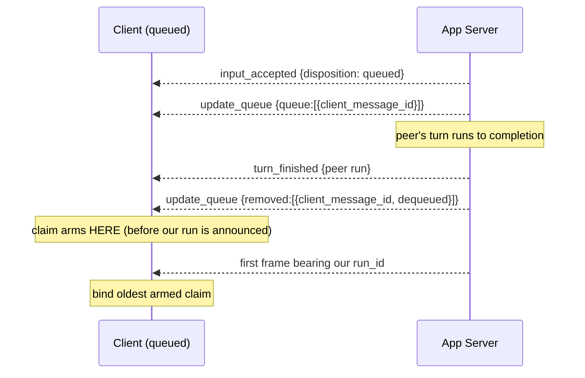

# Unit 5 Review Remediation

> **Numbering:** units in *this* plan are `Unit N`. Units in the parent milestone plan are always
> written `M1 Unit N`. The two sets are unrelated.

## Overview

A nine-persona review of the three Unit 5 commits (`36951978`, `34a2fc75`, `e5079323`), followed by
three plan-level reviews and a set of live probes, found that the milestone's headline safety
property — *an approval-gated turn must never hang every surface* — is **not implemented against the
protocol the server speaks**, and that several tests written to prove Unit 5's correctness instead
encode the assumptions they were meant to test.

This plan remediates those findings. It adds no features. Its output is that the claims Unit 5
already makes become true and independently falsifiable.

**M1 Unit 5's checkbox should be reopened** when Phase B lands: the terminal renders correctly, but
the safety property it advertises is absent.

## Problem Frame

### Verified defects, in descending severity

**1. The approval path targets a protocol that does not exist.** Read from the letta-code 0.30.20
bundle, the authoritative source for this undocumented IPC:

| Aspect | Implemented | Actual |
|---|---|---|
| Request | top-level frame `type: "approval_request_message"` | a **`stream_delta`** whose `delta.message_type === "approval_request_message"`, carrying `delta.tool_call = {tool_call_id, name, arguments}`; the turn then ends `stop_reason: "requires_approval"` |
| Identifier | `approval_request_id` (in-code: inferred, no live sample) | `tool_call.tool_call_id` |
| Response | a `type: "approval_send"` command | not a command the server parses; `approval_send` appears in the bundle only as a TUI error-context label |

`isApprovalRequest()` matches a frame type the server never emits, so the injecting client never
detects an approval, never responds, and an approval-gated turn stalls every attached surface. No
test could catch this: the mock was written from the same inference as the production code.

**2. Reconnect dedup is completely non-functional — newly proven, not merely suspected.** A single
probe capturing one turn's live delta ids and then listing the same conversation's messages:

```
LIVE delta ids:  letta-msg-27370, letta-msg-27371, letta-msg-27372  … (14)
SNAPSHOT ids:    ui-msg-7457, ui-msg-7456:assistant:1, ui-msg-7456:reasoning:0
OVERLAP:         0
```

`LiveDedup.admit()` compares `letta-msg-*` against a set of `ui-msg-*`. Disjoint namespaces, zero
overlap, so it never matches and dedup does nothing. This **answers** the open question M1 Unit 7
was carrying. The *fix* remains M1 Unit 7's (see Scope Boundaries); this plan records the answer and
removes the false green signal.

**3. Correlation ids collide across processes — visible in persisted server state.**
`nextRequestId` is a module-global counter, so every client process emits `rpc-1, rt-2, input-3,
cm-4`. Confirmed by running two processes, and confirmed again in the server's stored messages,
where `otid: "cm-4"` appears **twice** from two independent client processes. `ownership.ts` states
its safety rests on "each only ever matches its OWN values" — false for two surfaces, which is the
configuration M1 exists to support. The live two-peer proof passed only because both cores shared
one process and therefore one counter.

**4. Fail-closed does not cover its own primary case.** Reproduced by direct execution: after a
reconnect with an `input_accepted` lost in the gap, our own run is observed while the claim is
unarmed, lands in `seenRuns`, and `shouldRespondToApproval` returns `false` — because `seenRuns` is
tested *before* the degraded fallback. Nobody answers; the turn hangs. The safety net does not cover
the ordinary consequence of the very event it was written for.

**5. `beginSend()` registers a claim before the frame is known to have left.** `rawSend` throws when
the socket is not OPEN, leaving a permanent claim, so `hasOutstanding()` never clears and the client
stays degraded for the process lifetime.

### Corrected severity (verification changed the picture)

**The dequeue-vs-run frame-ordering hazard is latent, not live.** A captured two-peer run shows the
real server emits the **safe** order — `update_queue removed:[{dequeued}]` *then* the next run's
announcement. The project's own mock emits the inverted order, which is how the defect was
reproduced in isolation. So `RunOwnership` would misbehave *if* the order changed, and the mock is
lying about the server, but no live failure follows from ordering today. Unit 6 therefore hardens
defensively and detects the inverted order loudly, rather than restructuring attribution around a
hazard that has not been observed. This distinction matters: the alternative fix ("keep unattributed
runs bindable") would invert a currently-*correct* test and trade a hang for a duplicate-deny.

## Requirements Trace

L-numbers are local to this plan; parent requirements are cited as `M1 Rn`.

- **L1** — The approval policy behaves correctly against the *real* server contract: an
  approval-gated turn resolves rather than hanging, and exactly one client responds, at most once.
  (Precondition for `M1 R5`.)
- **L2** — Run attribution is correct under concurrent peers, a lost ack, a reconnect seam, and
  either dequeue ordering; and every attribution state is bounded in time.
- **L3** — Correlation identifiers are unique across processes, **and claim-state transitions are
  single-shot and irreversible under replay**, so a peer echoing our broadcast identifiers cannot
  mutate our state.
- **L4** — Test doubles can **falsify** client assumptions: the mock rejects malformed frames as the
  server does, models the real frame ordering and id shapes, and at least one test exercises each
  ordering the client's correctness depends on.
- **L5** — Protocol drift fails loudly, including inside the version gate, and the gate that proves
  it is actually run. (Parent protocol-coupling mitigation #3.)
- **L6** — The terminal degrades visibly and never crashes on input during a disconnect. (`M1 R17`.)
- **L7** — Untrusted relayed content cannot emit terminal control sequences **or forge
  client-generated UI** (origin labels, notices, approval prompts).
- **L8** — A client survives a real App Server restart, and long-lived client state is bounded.
- **L9** — Documentation *and in-code module headers* match shipped behavior.
- **L10** — The deny-only invariant is enforced structurally, not by call-site discipline.

## Scope Boundaries

- **Not** the catch-up dedup *fix*. `M1 Unit 7` owns the "no vanishing / no duplicated messages"
  criterion. This plan proves the namespace mismatch, records it, and removes the tests that assert
  the falsified premise — so `M1 Unit 7` starts from an honest baseline instead of a green lie.
- **Not** the `M1 Unit 6` web client. Where a decision would bind it, this plan records the
  constraint rather than implementing it.
- **Not** approval `allow`. M1 is deny-only; approve/resolve is the rail milestone.
- **Not** deployment or cutover (`M1 Unit 8`), and no changes to the App Server,
  `letta-push-receiver`, or any launchd artifact.
- **Not** a rewrite of the client-core architecture. `ownership.ts` is the right seam; its decision
  logic and its API shape are wrong, not its existence.

## Context & Research

### Relevant Code and Patterns

- `clients/letta-continuity-core/src/protocol.ts` — declares itself the sole home of every frame
  string and shape. Several findings are that invariant being violated (`render.ts` message-type
  constants, `index.ts` reading `frame.delta.id`, `stream.ts` re-deriving run ids) or
  under-enforced (`validateInboundFrame` checks only `event_seq` on `update_queue`).
- `clients/letta-continuity-core/test/helpers/mockServer.ts::guard()` — the existing mechanism for
  "the server drops malformed frames silently," added when `conversation_create` shipped with a
  wrong envelope. This plan extends that pattern rather than inventing a schema layer.
- `clients/letta-continuity-core/test/live.contract.test.ts` — the designated upgrade gate, already
  parameterized by URL/version and able to mint a scratch conversation. New live assertions extend
  this file.
- The parent plan's `M1 Unit 3` **forward-progress** watchdog — liveness defined on observed
  progress rather than wall-clock. Unit 6's claim expiry should follow this precedent, not a timer.
- The letta-code bundle is the contract source. Reading the server's own command guards is how the
  `conversation_create` envelope and the approval shape were both settled; it is the established
  technique here and precedes any live probe.

### Institutional Learnings

No `docs/solutions/` corpus exists. The functional equivalents:

- `docs/followups/2026-08-13-continuity-core-approval-correlation.md` — the open followup this plan
  closes (finding #1, whose stated root cause was itself wrong) and answers (finding #2).
- The parent plan's recorded precedent: *a mock that answers any shape rubber-stamps a malformed
  builder.* That precedent recurred in this diff on the highest-stakes path, which is why L4 is a
  first-class requirement rather than test hygiene.

### External References

External research **skipped deliberately**: this is letta-code's internal, unversioned, undocumented
IPC. No public documentation exists; the bundle is both specification and ground truth.

## Key Technical Decisions

- **Keep the parent's two-legged approval mitigation.** `M1`'s policy had two legs: *(1)* ensure the
  shared conversation's agent has no approval-requiring tools attached, and *(2)* client auto-deny as
  a backstop. The first draft of this plan remediated only leg 2 — the leg that may be
  unimplementable — and silently dropped leg 1, which is achievable today with no protocol
  archaeology. Leg 1 is restored as Unit 2 and does not depend on the spike.
- **Fail closed on `hasOutstanding()`, not on `degraded`.** The epistemic condition that should
  trigger a protective response is *"unattributable AND I have work outstanding"*. `degraded`
  (reconnect-specific) is one cause of unattributability and not the most common; gating on it is
  what leaves finding #4 open. `degraded` demotes to a diagnostic surfaced in `snapshot()`.
- **Therefore an unknown `input_accepted.disposition` PARKS rather than arms.** The original
  justification for arming was "failing to arm risks not denying our own approval." Once fail-closed
  keys on outstanding work, an unresolved claim already covers that, while arming now costs a real
  mis-binding — confidently answering a peer's approval while our own run goes unbound. This
  reverses the decision recorded in the shipped code.
- **`positivelyForeign` must be observable.** Definition: *a run first observed at a moment when we
  held zero claims and zero owned runs.* Nothing of ours could have been starting. "Seen while we
  were queued" is emphatically **not** foreign — defining it that way reproduces finding #4.
- **Attribution returns a classification; policy composes it.** `ownership.ts` exposes
  `attribute(runId) → "mine" | "foreign" | "unknown"` plus `hasOutstanding()`. Baking the M1 deny
  policy into the attribution module blocks `M1 Unit 6`, where a human is present and the right
  policy is "surface and let the user decide." Deciding this now is free; deciding it at `M1 Unit 6`
  means changing the module Phase B just stabilized.
- **REVISED by Unit 1 — approval correctness no longer depends on attribution at all.** Because the
  server broadcasts each approval to every subscriber and settles the race itself, the M1 policy
  becomes: *any client holding an unresolved approval answers, promptly, with deny.* A race is
  benign. This removes the plan's most delicate coupling. Attribution is still required for the
  terminal's own-vs-peer labels and for bounded state, but it is **no longer safety-critical**, so
  the fail-closed precedence table below applies to *labelling and diagnostics*, not to whether an
  approval gets answered.
- **Deny-only is enforced by type, not by argument.** The M1 response builder takes no decision
  parameter (or a `"deny"` literal). Reintroducing `allow` then requires a visible signature change
  at the rail milestone. The decision function likewise returns a decision rather than a boolean, so
  the fail-closed branch structurally yields *deny* instead of yielding "yes" to a caller that
  chooses.
- **Replay-resistance comes from single-shot transitions, not from unguessable ids.** Ids are
  broadcast by design, so unpredictability cannot stop replay. A claim may leave `queued` exactly
  once; a removal targeting a claim not in `queued` is a no-op and raises a protocol anomaly. This
  also hardens attribution against benign frame redelivery on reconnect, which is the stronger
  justification.
- **Claim expiry keys on observed stream inactivity, not elapsed wall-clock time.** Local agent turns
  in this system run 51s–600s, so any wall-clock budget short enough to bound over-denial is short
  enough to reap a live claim. This mirrors `M1 Unit 3`'s forward-progress watchdog.
- **Sanitize at the renderer, not the protocol layer** — correct for the terminal (`protocol.ts`
  sanitizing would corrupt content for the DOM consumer), but it must be paired with a *typed*
  handoff so `M1 Unit 6` cannot inherit the defect in a different injection class.
- **Extend `guard()`; extend `live.contract.test.ts`.** Existing patterns, not new machinery.

## Open Questions

### Resolved During Planning

- *Is the approval request a frame or a delta?* → A delta, with `delta.tool_call`.
- *Is `approval_request_id` real?* → No; the identifier is `tool_call.tool_call_id`.
- *Is `approval_send` a server command?* → No.
- *Do snapshot ids and live delta ids share a namespace?* → **No** — proven, zero overlap. Answers
  `M1 Unit 7`'s open premise.
- *Can attribution be made exact via `otid`?* → **No.** Snapshot user messages do carry our
  `client_message_id` as `otid`, but carry **no `run_id`**, so no otid→run mapping exists there. The
  positional heuristic stands, now as a knowingly-accepted risk with a named trigger.
- *Does the real server emit the fatal dequeue ordering?* → **No** — captured order is
  dequeue-then-run. Downgrades Unit 6's riskiest change to defensive hardening.
- *Should `ownership.ts` be replaced?* → No; its seam is right, its API and decision logic are not.
- *New plan or amend the parent?* → New plan, cross-referenced.

### Deferred to Implementation

- Whether an interactive approval can be answered by a WS client at all, and via which command.
  Unit 1 settles it; Units 5–6 branch on the verdict.
- Whether interactive approvals can fire at all under `permission_mode: unrestricted`, and whether
  that mode is settable per connection.
- What a **deny actually does to the turn** (error / retry / continue). The entire "over-denying is
  recoverable" trade rests on this and it has never been checked.
- Whether delegated/subagent turns mint their own `run_id` on the same stream.
- The exact inactivity budgets for claim and owned-run expiry (Unit 6), which depend on observed
  latencies.

## High-Level Technical Design

> *Directional guidance for review, not implementation specification.*

Corrected decision precedence — the shipped version tests `seenRuns` too early, which is what makes
`degraded` ineffective (finding #4):

```
attribute(runId)
  owned(runId)                                  -> "mine"
  firstSeenWhileWeHeldNothing(runId)            -> "foreign"
  otherwise                                     -> "unknown"

approvalPolicy(runId)                            [composed in index.ts, not in ownership.ts]
  attribute == "mine"                           -> deny
  attribute == "foreign"                        -> stay silent
  attribute == "unknown" AND hasOutstanding()   -> deny   (fail closed)
  otherwise                                     -> stay silent
  ...subject to: at-most-once per tool_call_id, and a per-episode deny rate cap
```

Frame ordering as **captured from the live server** — the safe order, which Unit 6 hardens against
losing rather than restructuring around:



## Implementation Units

### Phase A — Ground truth and unblocked work (parallelizable)

- [x] **Unit 1: Establish the attribution and approval contract** — DONE 2026-08-13. Verdict:
  **outcome 2 (a WS client can answer)**, but via a contract neither the code nor this plan's first
  draft had right, and the difference *removes* complexity. Full findings:
  `docs/plans/2026-08-13-approval-contract-findings.md`. Headlines:
  - The actionable request is a top-level **`control_request`** frame (`request_id =
    "perm-" + tool_call_id`, `request.subtype: "can_use_tool"`), **broadcast to every subscriber**.
    The `approval_request_message` delta is only a transcript projection — a delta-only client can
    display an approval but never answer one.
  - The response is an `input` with `payload.kind: "approval_response"`, carrying that `request_id`
    and `decision: {behavior: "deny", message}` (`message` required for deny).
  - **The server already enforces at-most-once** (`settled` guard in `requestApprovalOverWS`, plus
    `pendingApprovalResolvers` keyed by `(connectionId, requestId)` with an `__unowned_approval__`
    sentinel). A duplicate response is discarded with "Approval request is no longer pending".
  - ⇒ *"observers must not respond, to avoid duplicate responses"* — the parent's stated reason for
    coupling approvals to run ownership — **solves a problem that does not exist**. The only real
    failure mode is nobody answering.

**Goal:** Settle, from the bundle plus a bounded live probe, what a WS client receives for an
interactive approval, whether it can respond, and which frames carry the identifiers attribution
depends on. Produce a verdict Units 5 and 6 implement against.

**Requirements:** L1, L2

**Dependencies:** None. Blocks Units 5, 6, 8 (fixtures).

**Files:**
- Create: `docs/plans/2026-08-13-approval-contract-findings.md`
- Scratch probes under the session scratchpad (throwaway)

**Approach:**
- Read the bundle first; probe only what reading cannot settle. Any probe uses the **docs agent in a
  scratch conversation**, never MC.
- Enumerate the verdict as **four** outcomes, each with its downstream consequence, so the branch is
  decided once rather than re-litigated:
  1. *Approvals cannot fire under this deployment's permission mode* → delete the response path,
     assert the mode, and drop the one-responder invariant from L1/L2.
  2. *Can fire; a WS client can answer* → implement as planned.
  3. *Can fire; client cannot answer; the server times out or auto-denies* → detect-and-surface is
     sufficient; **the required output is the timeout value**.
  4. *Can fire; nobody can answer; the server blocks forever* → milestone-blocking; the remedy is
     Unit 2 (tool-set restriction) plus a parent-plan decision.

**Verification (each is a required written answer):**
- Which frame carries the approval request; which identifier correlates it; which command (if any)
  answers it; what happens when nobody answers, **including the timeout value**.
- What a deny does to the turn — error, retry, or continue.
- Whether delegated/subagent turns mint their own `run_id` on the same stream.
- **Unicast vs broadcast classification for every frame the client makes decisions on** — especially
  `input_accepted`. If it is broadcast, a peer can replay it to drop our claim, which changes Unit 4.
- The captured queued-turn frame order (dequeue notice vs first run-bearing frame vs
  `turn_finished`), confirming or overturning the capture recorded in Problem Frame.
- An explicit statement of which downstream units the verdict changes. If no live approval can be
  provoked, say so — Unit 8's approval fixtures then come from the bundle, marked unverified.

**Execution note:** Investigation spike; the deliverable is a findings document and a verdict.

---

- [x] **Unit 2: Remove the need for the backstop (tool-set precondition)**

**Goal:** Restore the parent policy's first leg — ensure the shared conversation's agent has no
approval-requiring tools attached — so the safety property does not rest solely on a backstop that
may be unimplementable.

**Requirements:** L1

**Dependencies:** None. Deliberately independent of Unit 1 — this is the mitigation that survives
every spike verdict.

**Files:**
- Create: `docs/runbooks/continuity-conversation-preconditions.md`
- Test: `clients/letta-continuity-core/test/live.contract.test.ts` (an opt-in live assertion)

**Approach:**
- Enumerate the target agent's attached tools and classify which can raise an approval.
- Make "no approval-requiring tool is attached to the continuity conversation's agent" an asserted,
  documented precondition rather than an assumption.
- If the assertion cannot be made over `/ws`, record how it is checked and by whom.

**Test scenarios:**
- Live (opt-in): the configured agent's tool set contains no approval-requiring tool; the assertion
  fails loudly if that changes.

**Verification:**
- A documented, checkable precondition exists, and the check is wired into the live gate.

---

- [x] **Unit 3: Connection and RPC error semantics**

**Goal:** Make drift and transport failure produce accurate, actionable outcomes instead of opaque
timeouts, silent gate bypass, or process death.

**Requirements:** L5, L8

**Dependencies:** None. **Hoisted ahead of Phase B** because Units 5 and 8 assert against the error
semantics this unit changes; landing it later means writing assertions twice.

**Files:**
- Modify: `clients/letta-continuity-core/src/ws.ts`
- Test: `clients/letta-continuity-core/test/core.integration.test.ts`

**Approach:**
- Register the pending waiter only after a successful send, so a synchronous send failure cannot
  orphan a promise whose later rejection has no handler.
- Reject the matching pending request when an inbound frame fails validation, so drift surfaces at
  the caller rather than as a timeout.
- Discriminate the three currently-laundered gate failures — *(a)* no response, *(b)* a response
  failing validation, *(c)* a response of the wrong type. Only (a) is "server too old" (warn); (b)
  and (c) are drift and must refuse under `refuse` policy. Note the existing code is already correct
  for a *parsed* mismatched version; the laundering is confined to these three.

**Test scenarios:**
- Error path: an RPC issued while the socket is not OPEN throws synchronously, leaves **no** pending
  entry, and produces no unhandled rejection or orphan timer.
- Error path: socket closes between open and hello → connect fails cleanly, no unhandled rejection.
- Error path: a response frame fails validation → the RPC rejects with the protocol error, not a
  timeout.
- Error path: `refuse` policy + a server answering unparseably → connect refuses.
- Edge case: `refuse` policy + a server that does not implement the info command → asserted either
  way, whichever the decision.
- Happy path: an unremarkable connect is unchanged.

---

- [x] **Unit 4: Process-unique, replay-resistant correlation**

**Goal:** Make identifiers unique per client instance *and* make claim-state transitions immune to a
replayed identifier.

**Requirements:** L3

**Dependencies:** None; runs parallel with Unit 1.

**Files:**
- Modify: `clients/letta-continuity-core/src/protocol.ts` (id generation)
- Modify: `clients/letta-continuity-core/src/ws.ts` — **required**: the `rt-` hello and every `rpc-`
  id are minted here; three of the four colliding ids come from this file
- Modify: `clients/letta-continuity-core/src/index.ts` (instance nonce)
- Modify: `clients/letta-continuity-core/src/ownership.ts` (single-shot transitions)
- Test: `clients/letta-continuity-core/test/protocol.contract.test.ts`, `test/ownership.test.ts`,
  `test/core.integration.test.ts`

**Approach:**
- Per-instance nonce plus the existing monotonic counter; thread it to `ws.ts` the way `onWarn` and
  the timeouts are already threaded. Keep it injectable for deterministic tests, and pin whether the
  counter stays shared across prefixes (several assertions and `__resetRequestCounter` depend on
  today's shared behavior).
- **Make the nonce overridable per send.** `M1 Unit 6`'s web client is *one* core fanning out to N
  browsers, so a per-core nonce would make every tab's turn look like "own" to the bridge. Without
  this, the web surface mislabels origin exactly as the terminal did.
- Single-shot transitions: a claim leaves `queued` exactly once; a removal for a claim not in
  `queued`, or for an id already consumed, is a no-op that raises a protocol anomaly.

**Test scenarios:**
- Edge case: two cores constructed with the counter reset between them emit **disjoint** id sets
  *(the shape today's suite structurally cannot express)*.
- Error path: replayed `dequeued` for an already-armed claim → no-op.
- Error path: replayed `cancelled` for an armed or bound claim → **claim survives** *(today this
  drops the claim and hangs the turn)*.
- Error path: a removal naming an id we never minted → no-op plus anomaly raised.
- Integration: two cores queued simultaneously → each arms only on its own dequeue notice.
- Happy path: ids remain monotonic and greppable within one instance.

### Phase B — Safety core

> Phase B must not land without Unit 6's expiry: Unit 6 deliberately *widens* the fail-closed path,
> and `~/bin/letta-continuity` execs from the repo tree, so an unbounded intermediate is immediately
> live for the user.

- [x] **Unit 5: Rebuild the approval path on the real contract**

**Goal:** Detect approval requests where the server emits them and respond (or surface them) per
Unit 1's verdict, at most once, with deny-only enforced structurally.

**Requirements:** L1, L5, L7, L10

**Dependencies:** Unit 1, Unit 3.

**Files:**
- Modify: `clients/letta-continuity-core/src/protocol.ts` — add the real shapes; **delete the
  fictions**: `Inbound.approvalRequestMessage`, `ApprovalRequestFrame`, `isApprovalRequest`,
  `approvalRequestId`, the `approval_send` builder, and the `approval_request_message` fixture
- Modify: `clients/letta-continuity-core/src/index.ts` — **owns the `routeFrame` reorder** (once the
  request is a delta, the top-level early-return cannot survive; ordering must be
  dedup → attribute → approval decision)
- Modify: `clients/letta-continuity-core/test/helpers/mockServer.ts` (emit the real shape)
- Test: `clients/letta-continuity-core/test/protocol.contract.test.ts`, `test/core.integration.test.ts`

**Approach:** *(rewritten after Unit 1 — the target is `control_request`, not the delta)*
- Add `control_request` as a first-class inbound frame with a `validateInboundFrame` case requiring
  `request_id` and `request.subtype`/`request.tool_call_id`. It is currently unknown to
  `protocol.ts` entirely, which is *why* approvals are invisible today.
- Respond via `input` / `payload.kind: "approval_response"` with the received `request_id` and
  `decision: {behavior: "deny", message}` — `message` is required by the server's validator.
- **Answer whenever we hold an unresolved approval; do not gate on ownership.** The server settles
  the race and discards the loser with "Approval request is no longer pending", so the observers-
  stay-silent rule is unnecessary and its failure mode (nobody answers) is the only real one.
- Keep local at-most-once per `request_id` anyway — not for server correctness, but so a replayed
  frame after a reconnect does not emit a redundant response that logs as an anomaly.
- Still render the `approval_request_message` delta as transcript, and surface every deny we emit
  with its reason. An auto-deny the user never sees is indistinguishable from the agent declining to
  use a tool, which makes the failure mode unfalsifiable in practice.
- Route `tool_call.name`/`arguments` through Unit 9's sanitizer, length-bounded, and **do not render
  `arguments` verbatim** — they can carry file contents or credentials into terminal scrollback.
  Mark the notice non-actionable in M1.

**Execution note:** Test-first — write the failing contract test from Unit 1's captured shapes before
touching the client.

**Test scenarios:**
- Happy path: a turn whose stream contains an approval → exactly one response from the owning
  client; the turn reaches a terminal state.
- **Security: the emitted response carries a deny decision — assert the wire value**, not just the
  count; and no constructible outbound frame carries an allow decision.
- Integration: a second attached client emits nothing.
- Edge case: the same approval delivered twice across a reconnect replay → exactly one response.
- Edge case: two approval requests in one turn → each answered once.
- Error path: correlating id absent → loud protocol error, no malformed response.
- Contract: captured request/response shapes round-trip; a renamed field fails loudly.

---

- [x] **Unit 6: Attribution correctness, bounded**

**Goal:** Make attribution correct under a lost ack, a reconnect seam, and either dequeue ordering —
and bounded in time so fail-closed cannot latch permanently.

**Requirements:** L2, L10

**Dependencies:** Unit 4. *Not* blocked by Unit 1: naming the output neutrally (`mine`/`foreign`/
`unknown`) decouples attribution from the approval policy, and `ownsRun()` already drives the shipped
terminal's origin labels. Only Unit 6's *integration* scenarios need Unit 1's verdict.

**Files:**
- Modify: `clients/letta-continuity-core/src/ownership.ts` (API + precedence + expiry)
- Modify: `clients/letta-continuity-core/src/index.ts` — move `beginSend()` to **after** a successful
  send (an attribution bug, not a terminal bug: a phantom claim pins fail-closed forever)
- Test: `clients/letta-continuity-core/test/ownership.test.ts`, `test/core.integration.test.ts`

**Approach:**
- Replace `shouldRespondToApproval` with `attribute()` + `hasOutstanding()`; compose policy in
  `index.ts`.
- Implement `positivelyForeign` with the observable definition from Key Decisions.
- Fail-closed keys on `hasOutstanding()`; `degraded` becomes diagnostic only.
- Unknown dispositions **park**.
- **Do not release ownership on `turn_finished{stop_reason: "requires_approval"}`** — the turn is
  pending resolution, not finished; releasing it makes a late approval read as foreign. Expiry must
  exempt runs parked in this state.
- Do not carry `armed` claims across a reconnect seam; demote them so they stop binding runs while
  still counting toward `hasOutstanding()`.
- **Expiry lives here, not in Unit 10**, keyed on observed stream inactivity per the `M1 Unit 3`
  forward-progress precedent. Choose the entry *shape* (timestamped, bounded-capable) now so Unit 10
  adds only policy.
- Cap fail-closed denies per degraded episode; on exceeding it, stop answering and render a loud
  actionable notice. Normal episodes produce one or two denies, so the cap costs nothing and stops
  the safety net being weaponized.
- Defensive only, per the corrected severity: detect the inverted dequeue ordering and warn loudly
  rather than restructuring binding around it.
- **State the model's blind spot:** every run is assumed to originate from a peer that minted a
  `client_message_id`. Agent- and scheduler-initiated turns (`M1 R3`, whose delivery is "re-point
  `LETTA_CALLBACK_URL` at the App Server") violate that. Record it; `M1 R3` introduces a run class
  this model has no place for.

**Execution note:** Test-first. **Assertion-change discipline is mandatory:** no existing assertion
may be deleted; each rewritten one keeps a comment naming the wrong premise it encoded and the
reproduced failure justifying the change. Three assertions are known to be in play and must be
inventoried before editing:
- `test/ownership.test.ts` "a `queued` ack waits for OUR dequeue" — likely restructured.
- `test/ownership.test.ts` "degraded mode still refuses a run already attributed to someone else" —
  **this one inverts**: that run was never *positively* foreign, only seen while unarmed. Most
  dangerous of the three.
- `test/ownership.test.ts` "acks and dequeues for other clients' ids are ignored" — ambiguous under
  the new rule.

**Test scenarios:**
- Happy path: `started` ack → next new run is `mine`; released on `turn_finished`.
- Edge case: `queued` ack, dequeue **before** the run announcement (the live order) → `mine`.
- Edge case: dequeue **after** the run announcement → detected and warned; no peer run is stolen.
- Edge case: ack lost across a reconnect, own run seen unarmed → approval answered *(currently
  returns "no responder")*.
- Edge case: armed claim + reconnect + a peer's run first on the new connection → not bound.
- Edge case: `turn_finished{requires_approval}` → ownership retained; a later approval still `mine`.
- Edge case: a claim whose stream goes inactive expires; `hasOutstanding()` clears.
- Edge case: expiry does **not** reap a claim whose turn is still emitting frames.
- Edge case: a send that throws leaves no claim (`pending === 0`).
- Error path: exceeding the deny cap stops answering and renders a notice.
- Integration: two cores, concurrent sends → disjoint attribution, one responder per approval.

### Phase C — Make the tests able to fail

- [x] **Unit 7: Test-double fidelity, guards, and scenario capability**

**Goal:** Make the doubles capable of *disproving* client assumptions, and give Units 5–6 the
capabilities their scenarios require.

**Requirements:** L4

**Dependencies:** Units 5–6 for the behavior they model. **However**, the scenario-enabling
capabilities below are preconditions for Units 5–6's own integration scenarios — land those parts
alongside the units that need them, and keep this unit scoped to guards, control deltas, chunking,
and the rejection counter.

**Files:**
- Modify: `clients/letta-continuity-core/test/helpers/mockServer.ts`
- Modify: `clients/letta-terminal/test/helpers/stubCore.ts`
- Modify: `clients/letta-continuity-core/test/catchup.test.ts` (see below)
- Test: `clients/letta-continuity-core/test/core.integration.test.ts`

**Approach:**
- **Scenario capability (needed by Units 5–6):** scriptable dequeue ordering, per-connection
  disposition, and a genuinely queued second client. Today `inputDisposition: "queued"` is only
  usable with `autoTurnOnInput: false`, which suppresses the dequeue notice entirely — so no offline
  test drives queued → dequeued → bind through the core at all.
- Server-transcribed guards for `input`, the approval response, and `runtime_start`; guard-failing
  frames dropped silently. Assert the `rejected` counter, which no test currently reads.
- Emit the control deltas every real turn ends with (`usage_statistics`, and the id-less
  `stop_reason`).
- `broadcastTurn` emits multiple chunks per message with distinct ids, matching the live capture and
  the terminal stub, so the two doubles stop contradicting each other.
- Add raw/malformed-frame injection and input rejection.
- **Retire the falsified-premise tests.** `test/catchup.test.ts`'s "admits EVERY delta of a new
  message (deltas share one delta.id)" asserts a premise now disproven. And the chunking change above
  necessarily breaks `core.integration.test.ts`'s "reconnect + message-id catch-up" assertion, which
  passes today only because the mock emits one snapshot-matching id per message. **The honest
  replacement is to assert only what remains provable offline** — that dedup behaves correctly *given
  a shared namespace in the mock* — explicitly flagged as premised on `M1 Unit 7`. Do **not** re-tune
  the mock until the old assertion goes green; that reinstates the false signal this plan exists to
  remove.

**Test scenarios:**
- Error path: a malformed `input` is dropped; the turn does not proceed; `rejected` increments.
- Error path: a malformed inbound frame reaches the core's error channel.
- Error path: `accepted:false` surfaces an error and drops the claim.
- Integration: control deltas flow end-to-end, render nothing, and do not break the streamed line.
- Regression: reverting any corrected outbound envelope fails the offline suite.

---

- [x] **Unit 8: Contract fixtures, live gate, and an actually-run gate**

**Goal:** Bring the frames this milestone depends on under a committed gate that is genuinely
executed.

**Requirements:** L4, L5

**Dependencies:** Unit 1 (captured samples — bundle-derived and marked unverified if no live
approval can be provoked), Unit 5.

**Files:**
- Modify: `clients/letta-continuity-core/test/protocol.contract.test.ts`
- Modify: `clients/letta-continuity-core/test/live.contract.test.ts`
- Modify: `clients/letta-continuity-core/src/protocol.ts` (tighten `validateInboundFrame`)
- Modify: `clients/letta-continuity-core/package.json` (a named gate script)

**Approach:**
- Fixtures for `input_accepted` (both dispositions), a **populated** `update_queue` (today's fixture
  has empty arrays, so `QueueItem`/`QueueRemoval` never round-trip), and the approval frames.
- Require the fields decisions are made on: the queue arrays and the removal disposition are
  currently unvalidated, yet a rename silently re-routes attribution.
- Subscribe the error channel in the live gate and assert **no protocol errors occurred** — the gate
  currently passes while the client discards a frame per turn.
- Exercise `conversation_messages_list` live; record whether its ids match the observed per-chunk
  delta ids (input to `M1 Unit 7` — this plan has already answered *no*, so the assertion pins it).
- Replace the duplicated drift test with its intended assertion: a control delta without an id is
  **accepted**; a content delta without one is rejected.
- **Own the CI decision.** L5 is not satisfied by a gate nobody runs. Either wire a named script with
  a documented trigger (before adding any version to `VALIDATED_SERVER_VERSIONS`), or move it to Open
  Questions with a named decider. Do not leave it in Risks as "worth addressing."

**Test scenarios:**
- Contract: every new frame round-trips through parse + validate.
- Error path: renaming `client_message_id`, `disposition`, or `accepted` fails loudly.
- Error path: content delta missing its id rejected; control delta missing its id accepted.
- Live: `conversation_messages_list` succeeds; the id-namespace relationship is asserted.
- Live: no protocol errors during a complete turn.

### Phase D — Surface hardening

- [x] **Unit 9: Terminal robustness, output safety, and endpoint validation**

**Goal:** The terminal survives input during a disconnect, cannot be driven or spoofed by relayed
content, and cannot be silently pointed off the loopback trust boundary.

**Requirements:** L6, L7

**Dependencies:** Unit 3.

**Files:**
- Modify: `clients/letta-terminal/src/session.ts`, `src/main.ts`, `src/render.ts`, `src/cli.ts`
- Test: `clients/letta-terminal/test/session.test.ts`, `test/cli.test.ts`

**Approach:**
- A send while the socket is closed produces a visible notice, not an uncaught throw out of the
  readline handler; the local echo must not claim a message was sent when it was not.
- **The renderer is not the only choke point.** `main.ts` writes server-derived text straight to
  stderr in at least four places — `onWarn` payloads (which embed server error strings), the
  `Could not attach:` message (which embeds server-reported version/capability strings, and Unit 3
  makes that path carry *more* server text), the fatal stack handler, and the attach banner
  (pointer-derived). Define the boundary as **every string not originating in this process** and
  route all of them through the sanitizer.
- **Allowlist, not blocklist:** keep printable plus `\n`/`\t`; drop C0/C1/DEL and everything from an
  introducer to its terminator. Name the sequences that matter for this threat model — **OSC 52**
  (writes the user's clipboard), OSC 8 (hyperlinks), DCS/APC/PM, and the **8-bit C1 forms**
  (`›`, ``) that bypass any ESC-anchored pattern. Decide explicitly on bidi overrides and
  zero-width characters — "accepted and documented" is a fine answer; silence is not.
- **L7 includes UI forgery.** `\n` survives sanitization by necessity, so content containing a
  newline followed by `peer › ` forges cross-surface attribution — a security label in this design.
  Add line discipline (re-emit the label on continuation lines) so content cannot occupy the label
  column, or narrow the claim.
- Length-bound each delta and notice; a multi-megabyte delta locks the terminal using no control
  character at all.
- **Validate the WS endpoint.** `--url`/`$LETTA_CONTINUITY_WS_URL` are unchecked, yet loopback
  binding *is* the entire trust boundary and `ws.ts`'s own header asserts it. Require `ws:`/`wss:`
  and a loopback host by default; anything else needs an explicit flag plus a rendered warning.

**Test scenarios:**
- Error path: input submitted while disconnected → notice rendered, process alive, no claim leaked.
- Security: a delta containing cursor-control, screen-clear, OSC 52, and 8-bit C1 forms renders inert.
- Security: the same for an error message, a stop reason, and a stderr warning path.
- Security: a delta containing `\n` + a label prefix cannot forge an origin label.
- Security: a non-loopback URL is rejected without the opt-in flag.
- Edge case: `disconnected` and `connecting` states render visibly.
- Edge case: colour enabled → each painted span is terminated; self and peer differ.
- Happy path: ordinary text and the client's own colour codes are unaffected.

**Note on test placement:** `render.ts` is currently exercised through `session.test.ts` driving
`StubCore`, which is this package's established pattern and already emits deltas, errors, and stop
reasons. Prefer extending it; add a separate pure-sanitizer table test only if the table is large
enough to justify the second entry point.

---

- [x] **Unit 10: Reconnect policy and bounded state**

**Goal:** Survive a real App Server restart; bound the remaining unbounded state.

**Requirements:** L8

**Dependencies:** Unit 6 (which owns claim expiry and chose the entry shape).

**Files:**
- Modify: `clients/letta-continuity-core/src/connection.ts`, `src/index.ts`
- Modify: `clients/letta-continuity-core/src/ownership.ts` (bound `seenRuns`)
- Modify: `clients/letta-terminal/src/session.ts`, `src/render.ts` (bound origin caches)
- Test: `clients/letta-continuity-core/test/connection.test.ts`, `test/core.integration.test.ts`

**Approach:**
- Exponential backoff with jitter, budgeted for a real restart. Today's policy — five attempts, fixed
  one second, no jitter — expires in about five seconds, shorter than a `letta server` boot, after
  which the client is permanently disconnected while still accepting input. Jitter matters because a
  watchdog restart drops every surface at once.
- **Require an injectable clock/RNG seam**, or the jitter scenario becomes a flaky timing test. Unit 4
  already establishes the injection pattern. Preserve a way to force a short deterministic schedule:
  the integration tests set `reconnectDelayMs` to 15–20 ms and the bounded-reconnect test runs
  against a ~6 s budget.
- Bound `seenRuns` and the terminal's origin caches; both grow per turn for the process lifetime.
- Surface budget exhaustion as an actionable message.

**Test scenarios:**
- Happy path: a server returning after longer than the old budget is re-attached.
- Edge case: repeated failures back off and jitter (against the injected seam, not wall clock).
- Edge case: many turns do not grow the run-id set without bound.
- Error path: exhausting the budget renders an actionable message.

### Phase E — Consistency

- [x] **Unit 11: Centralize protocol vocabulary**

**Goal:** Restore `protocol.ts`'s single-source-of-truth invariant so a server rename fails the gate
instead of silently blanking the UI.

**Requirements:** L5, L7

**Dependencies:** Units 5–8 (avoid churn while frames are moving).

**Files:**
- Modify: `clients/letta-continuity-core/src/protocol.ts` (export message-type / stop-reason /
  loop-status vocabulary; typed accessors for queue depth and subagent count; **a branded
  untrusted-text type** for server-derived strings)
- Modify: `clients/letta-terminal/src/render.ts` (consume them)
- Modify: `clients/letta-continuity-core/src/stream.ts`, `src/index.ts` (use the shared run-id and
  message-id accessors instead of re-deriving)
- Test: `clients/letta-continuity-core/test/protocol.contract.test.ts`; the **`letta-terminal` suite
  runs unchanged** as part of verification (the `file:` dependency makes this immediate)

**Approach:**
- The renderer decides what to display using its own copies of `assistant_message` /
  `reasoning_message` and reaches into raw frame fields; a rename passes validation and the terminal
  goes blank with no error.
- The branded type is the handoff that stops `M1 Unit 6` inheriting the sanitization defect in a
  different injection class — HTML injection, `javascript:` URLs in rendered markdown, and
  **markdown image auto-loading, which exfiltrates conversation content on render** and has no
  terminal analogue.
- Add a compile-time conformance assertion that `ContinuityCore` satisfies the terminal's
  `SessionCore` seam (method-syntax bivariance means today's single construction site is a weak
  check).
- Scope the invariant to `src/` explicitly, or include the test helpers — they construct frames from
  literal type strings throughout, so the unqualified claim is unachievable.

**Test scenarios:**
- Contract: the pinned version is a member of the validated set.
- Error path: renaming a delta message type fails the contract test rather than blanking output.
- Happy path: the terminal suite passes unchanged.

---

- [x] **Unit 12: Surface tidy and documentation truth-up**

**Goal:** Remove dead and misleading surface, and make the written record match the code — including
where it must record an unresolved question.

**Requirements:** L9

**Dependencies:** None for the surface-tidy half (independently landable); all prior units for docs.

**Files:**
- Modify: `clients/letta-continuity-core/src/protocol.ts` (pinned-version type — currently
  `string | undefined`, which lets the mock omit the version field entirely; remove the stale
  duplicate doc block and exports with no consumers)
- Modify: `clients/letta-continuity-core/src/catchup.ts` — remove `messagesListRequest` **and its
  test** at `test/catchup.test.ts`; it is used only by that test, so removing one without the other
  breaks the build and invites re-adding the wrapper
- Modify: `clients/letta-continuity-core/README.md`, `clients/letta-terminal/README.md`
- Modify: `docs/plans/2026-08-12-multi-surface-continuity-m1-web-terminal-plan.md` (reopen `M1 Unit
  5`; correct the wrapper description, which still prescribes credential sourcing the implementation
  deliberately rejected — this matters because `M1 Unit 6` is told to follow it)
- Modify: `docs/followups/2026-08-13-continuity-core-approval-correlation.md`
- Modify: `CLAUDE.md` (App Server port absent from the registry; `clients/` undocumented)

**Approach:**
- **Module headers are truth-upped by the unit that falsifies them**, not here — `ownership.ts`'s
  "LOAD-BEARING ASSUMPTION" and "each only ever matches its OWN values" die in Units 4 and 6;
  `index.ts`'s "approvals that FAIL CLOSED — the injecting client auto-denies" may die in Unit 1.
  A docs commit trailing the source by five units is stale on arrival. This unit covers the
  standalone documents.
- Prefer removing hardcoded test counts over updating them; they have drifted twice.
- Record the answered `M1 Unit 7` premise (namespace mismatch, zero overlap) in the followup so that
  unit starts from fact.

**Verification:**
- No reviewer-identified documentation claim remains contradicted by the code.

## System-Wide Impact

- **Interaction graph:** `routeFrame` is the junction for attribution, dedup, approvals, and
  rendering. Unit 5 owns its reorder; Unit 6 owns `ownership.ts`; Unit 11 owns the vocabulary. Kept
  in that order they stop editing the same twelve lines.
- **This changes already-shipped, live-verified behavior.** `ownsRun()` drives the terminal's
  `agent ›` vs `peer ›` labels, verified live at `M1 Unit 5`. Correcting attribution will visibly
  change labels for previously mis-bound cases — a user-facing change that belongs in acceptance.
- **`M1 Unit 6` inherits a policy, not just a seam.** Two peers with different approval policies
  break the one-responder invariant in a new way: the terminal auto-denies while the web user is
  still reading. Record as a decision that **approval policy is a core-level constant for M1 and
  `M1 Unit 6` must not diverge**, or design the injection point now.
- **Error propagation:** today a validation failure reaches an error listener but never the RPC
  caller, so drift reads as a timeout. Unit 3 aligns them; Unit 9 ensures the terminal renders rather
  than dies.
- **State lifecycle:** claims, owned runs, seen-run sets, and origin caches all currently grow or
  latch. Units 6 and 10 bound them. The interaction to watch is that expiry must not reap a claim
  whose turn is still running — hence inactivity-keyed, not wall-clock.
- **Deployment reality:** `~/bin/letta-continuity` execs from the repo tree, so every intermediate
  commit is immediately live for interactive use. This is what makes the Phase B ordering constraint
  binding rather than stylistic.
- **Integration coverage:** the corrected orderings and the guard additions are only meaningful as
  integration tests through the mock; `RunOwnership` unit tests alone cannot prove the client wires
  them correctly.

## Risks & Dependencies

- **Unit 1 may invalidate the M1 approval policy.** If a WS client cannot answer interactive
  approvals, "the injecting client auto-denies" is unachievable and the parent plan needs a decision.
  Unit 2 is the mitigation that survives that verdict — which is why it does not depend on the spike.
- **The server is the only specification**, and it ships frequently (24 versions in 7 weeks per the
  parent). Units 7 and 8 convert that into a loud failure; they are not deferrable "test work."
- **Unit 6 changes assertions that currently encode wrong expectations.** The assertion-change
  discipline and the named inventory are the mitigation; without them a genuine regression can be
  renamed into correctness.
- **The version gate proves version, not identity.** Nothing verifies the client is talking to the
  *sole-owner* App Server rather than any local process that bound 4577 first. With no auth on
  loopback, first-to-bind wins. Accepted residual for M1 — recorded so the rail milestone does not
  inherit the assumption that the gate is a trust boundary.
- **`~/bin/letta-continuity` is not git-tracked**, so drift from the tracked reference is invisible —
  the same class as the launchd plists. Its `PA_AI_REPO_ROOT` override relocates the exec path.
  Residual (requires local write), noted in Unit 12.
- **"Over-denying is recoverable" is not free.** The agent holds shell, filesystem, and messaging
  tooling; a spurious deny mid-chain can leave multi-step work half-applied. Recoverable for the
  turn, not costless — worth stating so the asymmetry is not read as "denies are free."
- **Reconnect changes are hard to prove offline.** A real restart needs the App Server, which is
  `M1 Unit 8`'s territory. Keep the offline proof honest about that limit.

## Documentation / Operational Notes

- Nothing here deploys; the App Server, launchd artifacts, and pointer file are untouched.
- If `M1 Unit 8` seeds the pointer, specify `0600` and write-temp-then-rename; the pointer decides
  *which agent* the client attaches to, so a swapped pointer silently retargets from a low-privilege
  agent to MC. The attach banner should display the pointer's path and label (sanitized) so a
  retarget is visible.
- Unit 1's findings document becomes the durable reference for the rail milestone, where approvals
  move from deny-only to a real approve/resolve flow.

## Sources & References

- **Parent plan:** `docs/plans/2026-08-12-multi-surface-continuity-m1-web-terminal-plan.md`
- **Origin requirements:** `docs/brainstorms/2026-08-12-agent-multi-surface-continuity-requirements.md`
- **Open followup:** `docs/followups/2026-08-13-continuity-core-approval-correlation.md`
- **Spike findings:** `docs/plans/2026-08-12-multi-surface-ws-spike-findings.md`
- **Contract source of truth:** the `@letta-ai/letta-code` bundle (0.30.20)
- Reviewed commits: `36951978`, `34a2fc75`, `e5079323`
